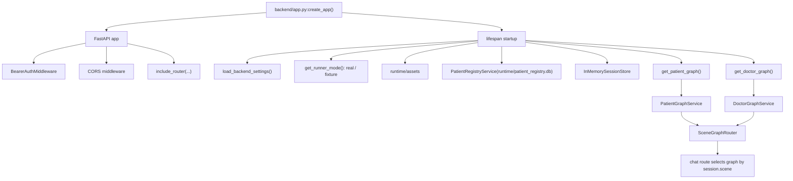
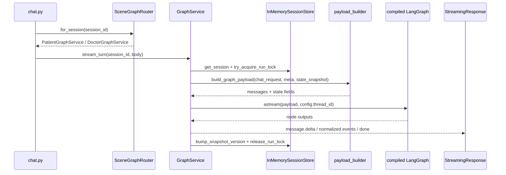
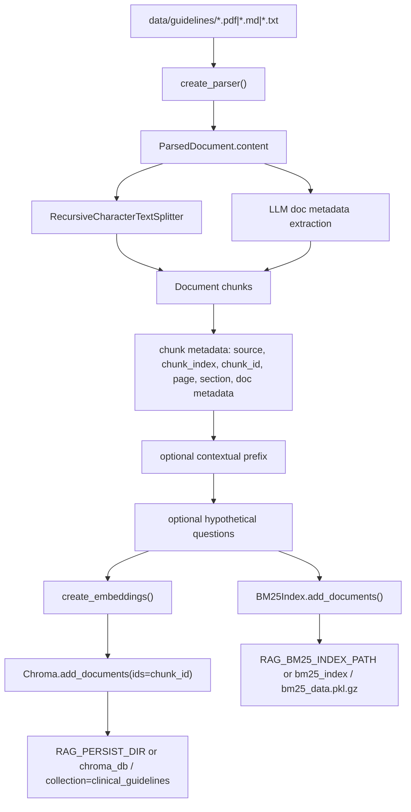
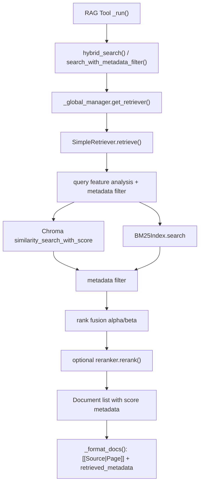
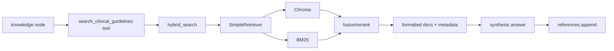

# 现状架构图谱

本文只描述当前代码已经实现的运行态，重点是入口、数据流、落盘位置和边界。涉及的主路径：

- `backend/app.py`
- `backend/api/routes/*`
- `backend/api/services/graph_service.py`
- `src/rag/retriever.py`
- `src/tools/rag_tools.py`
- `frontend/src/app/api/client.ts`
- `frontend/src/pages/workspace-page.tsx`

为讲清楚知识库构建和 graph 装配，本文也引用相邻入口：`src/rag/ingest.py`、`src/rag/bm25_index.py`、`backend/api/services/graph_factory.py`、`backend/api/services/payload_builder.py`、`src/graph_builder.py`、`src/nodes/knowledge_nodes.py`。

## 1. 总体运行入口



`backend/app.py` 是 BFF 的进程入口。`create_app()` 创建 FastAPI 实例，挂载鉴权、CORS 和各业务 router。真正的运行对象在 lifespan 中初始化，并集中放到 `app.state.runtime`：

- `runtime_root = runtime/`
- `assets_root = runtime/assets/`
- `patient_registry_service = PatientRegistryService(runtime/patient_registry.db)`
- `session_store = InMemorySessionStore()`
- `patient_graph = get_patient_graph(...)`
- `doctor_graph = get_doctor_graph(...)`
- `patient_graph_service = PatientGraphService(...)`
- `doctor_graph_service = DoctorGraphService(..., patient_registry=..., context_finalizer=...)`
- `scene_router = SceneGraphRouter(...)`

当前重要边界：

- 会话元数据存在 `InMemorySessionStore`，进程重启即丢失。
- 患者登记数据落盘到 `runtime/patient_registry.db`。
- 上传资产落盘到 `runtime/assets/`。
- RAG 知识库不在 backend startup 自动构建，startup 只会按配置 warmup retriever。
- `GRAPH_RUNNER_MODE=fixture` 时，patient/doctor graph 都走 `FixtureGraphRunner`；默认 `real` 才构建真实 LangGraph。

## 2. API 路由图谱

`backend/app.py` 当前挂载这些 router：

| Router | Prefix | 当前职责 |
| --- | --- | --- |
| `sessions.py` | `/api/sessions` | 创建/查询/重置 session，读取消息历史，医生 session 绑定患者，患者 session 保存身份 |
| `chat.py` | `/api/sessions` | `POST /{session_id}/messages/stream`，以 SSE 方式运行一轮 graph |
| `database.py` | `/api/database` | 医生侧历史病例库统计、搜索、详情、upsert、自然语言 query intent |
| `patient_registry.py` | `/api/patient-registry` | 患者登记库 recent/search/detail/records/alerts/delete/clear |
| `uploads.py` | `/api` | `POST /sessions/{session_id}/uploads`，患者侧文件上传、转换、登记、入上下文 |
| `assets.py` | `/api` | `GET /assets/{asset_id}`，读取上传资产内容 |

路由层没有直接运行 graph。`chat.py` 通过 `request.app.state.runtime.scene_router.for_session(session_id)` 取到对应 `GraphService`，再把返回的 async iterator 包成 `StreamingResponse(media_type="text/event-stream")`。

## 3. patient/doctor 运行时调度

### 3.1 session 创建与场景分流

`sessions.py:create_session()` 接收 `scene`，只允许 `patient` 或 `doctor`。

- `doctor`：只创建内存 session。
- `patient`：创建内存 session 后，还会通过 `PatientRegistryService.create_draft_patient()` 在 SQLite 中创建草稿患者，并把 `patient_id` 写回 session。

`SceneGraphRouter.for_session(session_id)` 是运行时分流点：

- `meta.scene == "patient"` -> `PatientGraphService`
- 其他场景 -> `DoctorGraphService`

### 3.2 GraphService 单轮执行

`GraphService.stream_turn(session_id, chat_request)` 是后端 graph 运行主链路：



关键执行步骤：

1. 读取 `SessionMeta`，不存在抛 `SessionNotFoundError`，路由转成 404。
2. `_prepare_session_meta()` 给子类插入场景特有上下文。
3. 取消上一轮未完成的 context maintenance。
4. 生成 `run_id`，用 `try_acquire_run_lock()` 防止同一 session 并发运行；失败时路由返回 409。
5. `build_graph_payload()` 合成 graph 输入：
   - 当前用户消息来自 `message/current_turn/content/text`
   - `pending_context_messages` 会插在当前用户消息之前
   - state snapshot 进入 `patient_profile`、`findings`、`roadmap`、`medical_card`、`summary_memory` 等字段
   - `context` 只透传 allowlist：`fixture_case`、`fixture_tick_delay_ms`、`current_patient_id`
6. 调用 `compiled_graph.astream(payload, config={"configurable": {"thread_id": thread_id}, "recursion_limit": 200})`。
7. 通过 `set_stream_callback()` 接收模型 token callback，转为 `message.delta`。
8. graph node output 交给 `normalize_tick()`，转为 `status.node`、`message.done`、`card.upsert`、`references.append` 等事件。
9. 成功时：
   - doctor service 会设置 `context.maintenance=running`
   - bump `snapshot_version`
   - yield `done`
   - 异步调度 context finalizer
10. 失败时：
   - 恢复被 drain 的 pending context messages
   - yield `error`
   - yield `done`，snapshot_version 回到本轮开始值

### 3.3 doctor 特有边界

`DoctorGraphService._prepare_session_meta()` 在医生 session 绑定 `patient_id` 且尚未注入过该患者时执行：

- 从 `PatientRegistryService.get_patient_summary_message(patient_id)` 取患者摘要。
- 从 `list_patient_alerts(patient_id)` 取冲突/未入快照等 alerts。
- 把摘要和 warning 合成 `HumanMessage`，通过 `session_store.enqueue_context_message()` 插到下一轮 graph 输入。
- 在 `context_state` 记录：
  - `bound_patient_id`
  - `bound_patient_snapshot_version`
  - `bound_patient_alert_count`

因此医生侧“绑定患者”并不直接改 graph state，而是在下一轮运行前把 registry 摘要作为上下文消息注入。

### 3.4 patient 特有边界

`PatientGraphService` 不启用 context finalizer，也不读取 patient registry 摘要。患者侧主要通过：

- session 创建时绑定草稿 `patient_id`
- `/api/sessions/{session_id}/identity` 锁定身份
- `/api/sessions/{session_id}/uploads` 上传病历/报告

上传后，`upload_service` 会把转换得到的 `medical_card` 写入 session `context_state`，并在需要时写入 `patient_registry.db` 的患者资产/记录表，同时 enqueue 一条上传引用消息供下一轮 graph 使用。

## 4. LangGraph 装配边界

`backend/api/services/graph_factory.py` 是 BFF 到 graph 的适配层：

- `get_runner_mode()` 读取 `GRAPH_RUNNER_MODE`，默认 `real`。
- `should_warm_rag()` 读取 `RAG_WARMUP`，默认 true。
- `get_patient_graph()` / `get_doctor_graph()` 缓存已构建 graph。
- `runner_mode=fixture` 时返回 fixture runner。
- `runner_mode=real` 时调用 `src.graph_builder.build_patient_graph()` 或 `build_doctor_graph()`。

`src/graph_builder.py` 里两套图的差异：

- doctor graph 节点更多：intent、planner、knowledge、case_database、rad_agent、path_agent、web_search、tool_executor、parallel_subagents、assessment、diagnosis、staging、decision、critic、citation、evaluator、finalize、general_chat、memory。
- patient graph 节点更短：intent、planner、clinical_entry_resolver、outpatient_triage、knowledge、assessment、chat_main、general_chat。
- 两套 graph 都会 `warmup_retriever()`，然后 `_load_agent_tools()` 加载工具。
- `_load_agent_tools()` 默认走 `list_tools()`，其中会加载 `get_enhanced_rag_tools()`；web search 打开时走 `list_tools_with_web_search()`。

## 5. 知识库如何构建和落盘

构建入口不在 BFF，而在 `src/rag/ingest.py`：

```bash
python -m src.rag.ingest
python -m src.rag.ingest --reset
```

构建数据流：



当前构建细节：

- 原始文档目录：`data/guidelines/`
- 支持后缀：`.pdf`、`.md`、`.txt`
- Chroma collection：`clinical_guidelines`
- Chroma 持久化目录：
  - 优先 `RAG_PERSIST_DIR`
  - 其次 `settings.rag.persist_dir`
  - 默认项目根目录 `chroma_db/`
- BM25 持久化目录：
  - `RAG_BM25_INDEX_PATH` / `settings.rag.bm25_index_path`
  - 默认 `bm25_index/`
- BM25 文件：
  - `bm25_data.pkl.gz`
  - `bm25_data.meta.json`
- embedding 后端：
  - `RAG_EMBEDDING_BACKEND=api`：走 `EMBEDDING_API_BASE` + `EMBEDDING_API_KEY`，DashScope base 会走自定义 `_DashScopeEmbeddings`
  - `RAG_EMBEDDING_BACKEND=local`：走本地 Hugging Face model，需要 `torch`/`transformers`

`--reset` 当前会删除 Chroma collection `langchain` 和 `clinical_guidelines`，并清空 BM25 index。注意：这只是重建知识库，不会改 backend runtime 的 session、patient registry 或 assets。

关键边界：

- backend 启动不会自动 ingest；graph startup 的 `warmup_retriever()` 只是初始化和缓存 retriever。
- Chroma 与 BM25 是两套独立落盘，ingest 会从同一批 chunks 同步重建。
- 检索时如果 BM25 不可用或为空，`SimpleRetriever` 会回退到向量检索。

## 6. RAG 检索链路

### 6.1 工具注册

`src/tools/rag_tools.py` 把检索能力封装成 LangChain `BaseTool`：

- `search_clinical_guidelines`
- `search_treatment_recommendations`
- `search_staging_criteria`
- `search_drug_information`
- `search_by_guideline_source`
- `hybrid_guideline_search`
- `list_guideline_toc`
- `read_guideline_chapter`

当前 `get_enhanced_rag_tools()` 实际返回：

- `ClinicalGuidelineSearchTool`
- `TreatmentSearchTool`
- `StagingSearchTool`
- `DrugInfoSearchTool`
- `GuidelineStructureTool`
- `GuidelineReaderTool`

`HybridSearchTool` 和 `GuidelineSourceSearchTool` 在 `get_all_rag_tools()` 中可用，但不是 `get_enhanced_rag_tools()` 的默认子集。

### 6.2 从 graph 到 retriever

RAG 主要在 `src/nodes/knowledge_nodes.py:node_knowledge_retrieval()` 中被 graph 调用：

1. 从工具列表里找 `search_clinical_guidelines` 作为 local RAG。
2. plan-driven 模式下按 `current_step.tool_needed` 选择 TOC、chapter、search 或 treatment search。
3. 普通模式下，如果问题需要患者上下文，会先调用 local RAG：`local_rag_tool.invoke({"query": user_query, "top_k": 4})`。
4. local context 不足时，再按配置和工具可用性走 web search 或 sub-agent。
5. 工具输出中的 `[[Source:file|Page:n]]` 与 `<retrieved_metadata>` 会被节点整理进 `retrieved_references`。
6. `normalize_tick()` 把 `retrieved_references` 转为 SSE `references.append`。

### 6.3 retriever 内部链路

`src/rag/retriever.py` 当前主链路：



核心实现点：

- `_get_vectorstore()` 用 `lru_cache(maxsize=1)` 缓存 Chroma 实例。
- `_GlobalRetrieverManager` 单例缓存 `SimpleRetriever`、Chroma 和 reranker。
- `SimpleRetriever.retrieve()` 默认使用 hybrid：
  - 向量检索：`vectorstore.similarity_search_with_score(query, k, filter=metadata_filter)`
  - BM25 检索：`BM25Index.search(query, k)`
  - metadata filter 支持 `$eq`、`$in`、`$ne`、`$and`、`$or`
  - hybrid 融合默认向量权重 `alpha=0.7`，BM25 权重 `0.3`
  - 查询含强关键词/数字/缩写时会动态提高 BM25 权重
  - 有 reranker 时先扩大候选集，再重排取 top-k
- 检索指标写到 thread-local：`reset_retrieval_metrics()` / `consume_retrieval_metrics()`，供决策节点记录 retrieval latency。

输出边界：

- retriever 返回 `Document[]`。
- rag tool 把文档格式化为文本，包含可解析 citation anchor 和 metadata JSON。
- graph 节点再把文本合成回答，并把 references 推到前端。

## 7. 前端 API 调用和 SSE 消费

### 7.1 ApiClient

`frontend/src/app/api/client.ts:createApiClient()` 是前端请求集中入口。

普通 JSON API 统一走：

- `buildUrl(path, baseUrl, query)`
- `buildJsonHeaders()`
- `parseJsonResponse<T>()`
- 非 2xx 抛 `ApiClientError(status, message, detail)`

消息流特殊处理：

```ts
streamTurn(sessionId, request, onEvent, signal, traceTap) {
  return streamJsonEvents({
    url: `/api/sessions/${sessionId}/messages/stream`,
    body: request,
    onEvent,
    signal,
    traceTap,
  });
}
```

这里没有使用浏览器 `EventSource`，因为当前接口是 `POST` JSON body。实际实现位于 `frontend/src/app/api/stream.ts`：

- `fetch(..., { method: "POST", body: JSON.stringify(body), signal })`
- `response.body.getReader()`
- `TextDecoder` 持续解码 chunk
- 按 `\n\n` 分割 SSE block
- 忽略 `:` 开头的 heartbeat/comment 行
- 只解析 `data:` 行为 `StreamEvent`
- 每个事件先给 `traceTap`，再给 `onEvent`

### 7.2 WorkspacePage 的运行流

`frontend/src/pages/workspace-page.tsx` 是当前工作区页面主容器。它通过 `useSceneSessions()` 同时维护 patient 和 doctor 两个 session：

- session id 存在 `localStorage`
  - `langg.workspace.patient-session-id`
  - `langg.workspace.doctor-session-id`
- 启动时先尝试恢复已有 session。
- 404 说明后端内存 session 已丢失，会清 localStorage 并创建新 session。
- 两个 session 都 ready 后进入 workspace。

提交消息时：

1. `submitPrompt()` 读取当前 `activeScene` 的 draft。
2. `submitMessage(scene, prompt, context?)`：
   - 生成 `trace_id`
   - 创建 `AbortController`
   - abort 上一条未完成 stream
   - 本地插入 optimistic user message
   - doctor 侧会先 `primeDoctorClinicalWorkflow()`，让 UI 预置 roadmap/plan scaffold
   - 构造 `ChatTurnRequest`
   - 调用 `apiClient.streamTurn(...)`
3. 每个 SSE event 到达后：
   - `traceTap` 记录流式观测时间
   - `message.done` 会更新 latency probe
   - `reduceStreamEvent(current, event)` 把事件落入 `SessionState`
4. stream 完成或失败后清理 `activeStreamRef` 和 `isStreaming`。

### 7.3 前端消费的主要事件

`frontend/src/app/store/stream-reducer.ts` 当前处理这些事件：

| Event | 前端状态变化 |
| --- | --- |
| `status.node` | 更新 `statusNode`，推进 roadmap |
| `message.delta` | 创建或追加流式 AI 消息 |
| `message.done` | 写入最终 AI 消息、thinking、inline cards |
| `card.upsert` | 写入 `cards`，并尽量挂到最新 AI 消息 |
| `roadmap.update` | 替换 roadmap |
| `plan.update` | 替换 plan |
| `findings.patch` | merge findings |
| `patient_profile.update` | 更新 patient profile |
| `stage.update` | 更新 clinical stage |
| `references.append` | 去重追加 references |
| `safety.alert` | 设置 blocking safety alert |
| `critic.verdict` | 更新 critic 状态 |
| `context.maintenance` | 更新 context maintenance 状态 |
| `error` | 标记 lastError，并把当前 plan step 置 blocked |
| `done` | 更新 `threadId`、`snapshotVersion`，清理 active run/status |

doctor 侧 context maintenance 的前端补偿机制：

- 后端在 graph 成功后先 SSE 一个 `context.maintenance(status=running)`。
- `WorkspacePage` 检测当前 session `contextMaintenance.status === "running"` 且不在 streaming 时，每 1.5 秒调用 `apiClient.getSession(sessionId)`。
- 拉到新 snapshot 后通过 `applyResponseToScene()` hydrate 到当前 scene。

## 8. 关键数据边界

### 8.1 持久化边界

| 数据 | 位置 | 生命周期 |
| --- | --- | --- |
| session id/thread id/active run/context_state | `InMemorySessionStore` | 进程内，重启丢失 |
| LangGraph checkpoint | `get_checkpointer(settings.checkpoint)` | 取决于 checkpoint 配置 |
| 患者登记库 | `runtime/patient_registry.db` | SQLite 落盘 |
| 上传资产 | `runtime/assets/` | 文件落盘 |
| Chroma 向量库 | `RAG_PERSIST_DIR` 或 `chroma_db/` | 构建后落盘 |
| BM25 词法索引 | `RAG_BM25_INDEX_PATH` 或 `bm25_index/` | 构建后落盘 |
| 前端当前 session id | `localStorage` | 浏览器本地；后端 session 丢失时需重建 |

### 8.2 并发边界

- 每个 session 只有一个 active run。
- chat stream 和 upload 都会使用 session run lock。
- 新 stream 开始时前端会 abort 旧 stream。
- 后端同 session 并发请求返回 409。

### 8.3 场景边界

- patient scene：患者自述、身份、上传、轻量 graph；创建时自动有 draft patient。
- doctor scene：可绑定 registry patient；下一轮运行前注入患者摘要；graph 节点包含病例库、影像、病理、决策和引用链路。

### 8.4 RAG 边界

- ingest 是离线动作。
- runtime 只读 Chroma/BM25 并缓存 retriever。
- RAG tool 输出先是文本，再由 graph synthesis 变为用户可见回答。
- citations/references 的结构化传递依赖工具输出和节点提取逻辑，前端只消费最终 `references.append`。

## 9. 端到端主链路速查

### 患者提问

```mermaid
flowchart LR
    A["WorkspacePage patient draft"] --> B["ApiClient.streamTurn"]
    B --> C["POST /api/sessions/{id}/messages/stream"]
    C --> D["SceneGraphRouter -> PatientGraphService"]
    D --> E["build_graph_payload"]
    E --> F["patient LangGraph"]
    F --> G["knowledge / assessment / chat_main"]
    G --> H["SSE events"]
    H --> I["streamJsonEvents"]
    I --> J["reduceStreamEvent(patient.state)"]
```



### 医生绑定患者后提问

```mermaid
flowchart LR
    A["Doctor binds patient"] --> B["PATCH /api/sessions/{id}"]
    B --> C["session_store.patient_id"]
    C --> D["next stream"]
    D --> E["DoctorGraphService._prepare_session_meta"]
    E --> F["PatientRegistry summary + alerts"]
    F --> G["pending_context_messages"]
    G --> H["build_graph_payload"]
    H --> I["doctor LangGraph"]
    I --> J["SSE events + context maintenance"]
```



### RAG 查询


