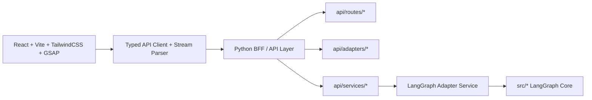

# Streamlit 替换为 React + TailwindCSS + GSAP（保留 LangGraph 架构）设计文档

**日期：** 2026-04-07  
**状态：** Draft  
**目标：** 将现有 Streamlit 前端全量替换为前后端分离架构，其中前端采用 `React + Vite + TailwindCSS + GSAP`，后端新增 Python BFF/API 层承载 LangGraph 会话、流式执行、上传与资产访问，同时保留现有 `src/` 下的 LangGraph 智能体主干。

## 1. 设计原则

- 保留现有 LangGraph 业务主干，不重写 `src/graph_builder.py`、`src/state.py`、`src/nodes/*`、`src/tools/*`、`src/services/*` 的核心职责。
- 新增独立 Python BFF/API 层，负责 HTTP/SSE、会话、上传、资产、事件规范化。
- 新增独立 React 前端，仅消费标准化协议，不再感知 `Streamlit session_state`。
- BFF 必须统一卡片数据三通道，前端只消费 `card.upsert`。
- 迁移前先清理 `src/state.py` 中的重复字段声明，避免 Pydantic 模型阴影与 snapshot 序列化歧义。
- 迁移期间保留旧 `app/` 作为参照实现，React 验证通过后再下线 Streamlit 入口。

## 2. 目标架构与模块边界



### 2.1 保留层

- `src/graph_builder.py`
- `src/state.py`
- `src/nodes/*`
- `src/tools/*`
- `src/services/*`
- `src/rag/*`
- `src/checkpoint.py`

这些目录继续承载智能体编排、状态定义、工具调用、知识检索和医学业务逻辑，不直接依赖 React/FastAPI。

### 2.2 新增层

`backend/` 为新 BFF/API 工程，内部按职责拆为：

```text
backend/
  app.py
  api/
    routes/
      sessions.py
      chat.py
      uploads.py
      assets.py
    adapters/
      event_normalizer.py
      card_extractor.py
      state_snapshot.py
    schemas/
      requests.py
      events.py
      responses.py
    services/
      graph_service.py
      graph_factory.py
      session_store.py
      upload_service.py
      asset_service.py
```

`frontend/` 为新 Web 前端：

```text
frontend/
  index.html
  package.json
  vite.config.ts
  tailwind.config.ts
  postcss.config.js
  src/
    main.tsx
    app/
      api/
      store/
      router.tsx
      providers.tsx
    pages/
      workspace-page.tsx
    features/
      chat/
      cards/
      roadmap/
      uploads/
      patient-profile/
      execution-plan/
    components/
      layout/
      primitives/
      motion/
    styles/
      globals.css
      tokens.css
```

### 2.3 迁移层

- `app/` 旧 Streamlit UI 在迁移期间保留，只作为对照与回归参照。
- 迁移完成后从运行入口和依赖声明中移除 Streamlit。

## 3. 会话模型与状态归属

### 3.1 双层会话

- `session_id`：BFF 对前端暴露的会话标识
- `thread_id`：LangGraph checkpointer 使用的线程标识

约束：

- 一个前端会话对应一个活动 `thread_id`
- React 不直接管理 `thread_id`
- `reset` 会生成新的 `thread_id`

### 3.2 LangGraph / Checkpointer 持有

以下状态继续由 `CRCAgentState` 和 checkpointer 持有：

- `messages`
- `patient_profile`
- `findings`
- `clinical_stage`
- `assessment_draft`
- `decision_json`
- `roadmap`
- `critic_verdict`
- `critic_feedback`
- `iteration_count`
- `current_plan`
- `retrieved_references`
- 其他与诊疗推理直接相关的智能体状态

### 3.3 BFF Session Store 持有

以下状态不进入 `CRCAgentState`，由 `session_store.py` 保存：

- `session_id -> thread_id`
- `snapshot_version`
- `processed_files`
- `uploaded_assets`
- `asset_id -> filepath/content-type/derived assets`
- `active_run_id`
- `created_at / updated_at / expires_at`

注意：

- `iteration_count`、`critic_feedback`、`critic_verdict`、`current_plan` 已在 `CRCAgentState` 中，不应重复存入 session store。
- `processed_files` 应从 Streamlit 的 `set()` 升级为 `sha256 -> ProcessedFileRecord`。
- `src/state.py` 中当前存在重复字段声明，至少包括 `retrieved_references` 与 `subagent_reports`；这一步必须在迁移正式开始前清理。

### 3.4 React 本地状态

以下状态仅由前端本地 store 管理：

- 当前输入草稿
- 当前展开卡片
- 右栏抽屉/面板开合
- 全屏 viewer 状态
- 动画状态
- 流式请求中的 loading / cancel UI

以下 Streamlit 时代状态迁移后删除：

- `graph_input_cursor`
- `show_*_popup`
- `decision_json_updated`

## 4. 流式协议与卡片统一

### 4.1 标准流事件

前端仅消费以下事件：

- `status.node`
- `message.delta`
- `message.done`
- `card.upsert`
- `roadmap.update`
- `findings.patch`
- `patient_profile.update`
- `stage.update`
- `references.append`
- `safety.alert`
- `critic.verdict`
- `plan.update`
- `error`
- `done`

### 4.2 SSE 传输模型

- 请求方式：`POST /api/sessions/{session_id}/messages/stream`
- 响应类型：`text/event-stream`
- 前端用 `fetch` 读取流，而不是原生 `EventSource`

原因：

- 需要 `POST body`
- 后续可附带鉴权头、附件、取消信号
- 更适合 typed stream parser

### 4.3 卡片三通道统一

卡片来源存在三条通道：

- A. 顶层 state 字段，如 `node_output["patient_card"]`
- B. `findings` 内嵌卡片，如 `node_output["findings"]["tumor_detection_card"]`
- C. `AIMessage.additional_kwargs`，如 `msg.additional_kwargs["imaging_card"]`

统一规则：

- 由 `card_extractor.py` 在 BFF 内做单次抽取
- 前端只接收 `card.upsert`
- 前端不感知卡片真实来源通道
- `source_channel` 仅保留给日志/调试

优先级：

- `top-level state` > `findings` > `message.additional_kwargs`

推荐卡片注册表：

- `medical_card`
- `patient_card`
- `imaging_card`
- `tumor_detection_card`
- `pathology_card`
- `pathology_slide_card`
- `radiomics_report_card`
- `decision_card`

`decision_json` 规范化为 `card.upsert(card_type="decision_card")`，不再单独设计 Streamlit 风格布尔刷新状态。

### 4.4 第一版流式粒度决策

第一版正式保证的流式粒度为“节点级”，不是 token 级。

具体定义：

- 保证发送 `status.node`
- 保证发送结构化状态事件，如 `card.upsert`、`stage.update`、`plan.update`
- 保证发送最终 `message.done`
- `message.delta` 作为增强能力保留，但第一版只要求“文本块级/chunk 级”，不要求逐 token

原因：

- 当前代码主干已经稳定暴露节点级执行过程
- token 级流需要更深地绑定底层 LLM callback 与取消/重连语义
- 以节点级为正式验收口径，更符合当前代码与测试复杂度

## 5. 前端信息架构

### 5.1 页面布局

桌面端采用三栏工作台：

- 左栏：上传、患者画像、roadmap
- 中栏：聊天主工作区、执行状态、输入框
- 右栏：卡片 dock、卡片详情、执行计划、引用

平板端：

- 左栏收窄
- 右栏改抽屉

手机端：

- 切为 `Chat / Patient / Cards` 三个 tab

### 5.2 交互映射

- `status.node` 驱动执行状态条
- `message.delta` / `message.done` 驱动聊天时间线
- `card.upsert` 更新右栏卡片 dock
- `patient_profile.update` 更新左栏患者摘要
- `stage.update` 驱动 roadmap 阶段高亮
- `plan.update` 更新右栏计划树
- `safety.alert` 显示阻断性警报横幅
- `critic.verdict` 显示自动纠错/审核结果

### 5.3 GSAP 使用边界

本设计继续保留 GSAP，而不切换到 Framer Motion。

原因：

- 用户最初明确指定了目标栈为 `React + TailwindCSS + GSAP`
- 若引入 Framer Motion，仅是把“单一动画库”变成“重新选型”，并不会自动降低迁移复杂度
- 第一版将 GSAP 严格限制为薄层结构动效，不再额外引入第二套动画框架

如果后续明确放宽原始技术栈要求，可单独评估用 Framer Motion 替代 GSAP，但不在本次迁移规范范围内。

允许：

- 首屏三栏入场
- 节点状态切换过渡
- 卡片生成高亮入场
- roadmap 阶段推进动画
- 全屏 viewer 开关转场

禁止：

- 长段医学结论逐字动画
- 流式 token 上叠加花哨 motion
- 影响阅读与截图的装饰性滚动动画

## 6. 后端 API 契约

核心端点：

- `POST /api/sessions`
- `GET /api/sessions/{session_id}`
- `GET /api/sessions/{session_id}/messages`
- `POST /api/sessions/{session_id}/messages/stream`
- `POST /api/sessions/{session_id}/uploads`
- `POST /api/sessions/{session_id}/reset`
- `GET /api/assets/{asset_id}`

### 6.1 `POST /api/sessions`

返回：

- `session_id`
- `thread_id`
- `snapshot`

### 6.2 `GET /api/sessions/{session_id}`

返回聚合恢复态：

- `messages`
- `messages_total`
- `messages_next_before_cursor`
- `cards`
- `roadmap`
- `findings`
- `patient_profile`
- `stage`
- `assessment_draft`
- `current_patient_id`
- `references`
- `plan`
- `critic`
- `safety_alert`
- `uploaded_assets`

恢复态大小控制规则：

- `GET /api/sessions/{session_id}` 默认只返回最近 `50` 条可渲染消息
- 通过 `message_limit` 查询参数允许调整窗口，但服务端设置最大上限
- 卡片、消息、患者画像中的大文件内容只返回 `asset_id` / `asset_url` / 元数据，不返回 base64 原文
- 影像、切片、报告、缩略图统一引用化，不在 snapshot 中内联

### 6.2.1 `GET /api/sessions/{session_id}/messages`

职责：

- 分页获取更早消息
- 支持 `before` + `limit` 的游标式翻页
- 仅返回前端渲染所需的 message view model，不返回 LangChain 原始对象

### 6.3 `POST /api/sessions/{session_id}/messages/stream`

输入：

- 用户消息
- 可选上下文，如 `current_patient_id`

输出：

- 标准 SSE 事件流
- 本轮结束必须发 `done`
- 出错时发 `error` 后仍发 `done`

断连/重连协议：

- 每轮 stream 分配 `run_id`
- SSE 每 15 秒发送心跳注释 `: ping`
- 若客户端在收到 `done` 前断连，服务端取消该 run 的 coroutine，并释放 session 级锁
- 第一版不提供 `Last-Event-ID` 回放与中途续流
- 客户端重连后通过 `GET /api/sessions/{session_id}` 恢复最新 snapshot，必要时再调用消息分页接口补历史

### 6.4 `POST /api/sessions/{session_id}/uploads`

职责：

- 文件校验
- 文档提取/转换
- 资产注册
- 去重登记

### 6.5 `GET /api/assets/{asset_id}`

职责：

- 受控读取上传与派生资产
- 不暴露任意本地绝对路径给前端

### 6.6 认证与 CORS

第一版即使内部使用，也保留基础认证与跨域设计。

认证策略：

- 本地开发：允许 `AUTH_MODE=none`
- 部署环境：默认 `AUTH_MODE=bearer`
- `Authorization: Bearer <token>` 适用于普通 API、SSE、资产访问
- 后续若接入统一网关/SSO，可在 BFF 入口层替换认证实现，但不改变前端 API 契约

CORS 策略：

- 开发环境仅允许 `http://localhost:5173`
- 测试/生产环境使用显式 allowlist，例如 `FRONTEND_ORIGINS`
- 不允许 `*`
- 允许的方法限定为 `GET`、`POST`、`OPTIONS`
- 允许的请求头至少包括 `Authorization`、`Content-Type`、`X-Request-ID`
- 第一版默认 `allow_credentials=false`

## 7. 后端内部实现

### 7.1 运行时装配

- `graph_factory.py` 复用现有 `src/graph_builder.py`
- 启动时 compile graph 一次
- checkpointer 直接复用 `src/checkpoint.py`

部署约束：

- `MemorySaver` 仅用于本地开发
- 第一版正式部署采用“单 worker 进程 + asyncio 协程并发”
- 第一版不支持多 worker 共享 in-memory session store
- 若未来升级到 multi-worker，必须同时满足：
  - 外置 session store
  - 分布式锁
  - 非 `memory` checkpointer
  - 推荐 `postgres` 或 `redis`，不再以 `sqlite` 作为多 worker 方案

### 7.1.1 第一版并发模型与锁策略

第一版并发模型明确为：

- `uvicorn` 单 worker 进程
- 进程内 `asyncio` 协程并发
- `session_id` 级别的互斥锁

锁策略：

- `messages/stream`、`uploads`、`reset` 都属于“会话级写操作”
- 同一 `session_id` 下，以上写操作共用同一把 `asyncio.Lock`
- 若锁已被占用：
  - `messages/stream` 返回 `409 SESSION_BUSY`
  - `uploads` 返回 `409 SESSION_BUSY`
  - `reset` 返回 `409 SESSION_BUSY`
- `GET /api/sessions/*` 与 `GET /api/assets/*` 属于只读操作，不参与会话写锁，但读取前需拿到一致性快照副本

这样定义的原因是：

- 第一版优先保证正确性和语义稳定
- 直接避免“流式执行中上传/重置导致会话元数据竞争”
- 与当前 `thread_id + checkpointer` 的单轮执行模型一致

### 7.2 `graph_service.py`

职责：

- 读取 `session_id -> thread_id`
- 获取并发运行锁
- 组装 payload
- 调用 `graph.astream(...)`
- 将 raw event 交给 `event_normalizer`
- 流结束后构建 snapshot，递增 `snapshot_version`

### 7.3 `event_normalizer.py`

职责：

- 把 LangGraph raw tick 规范化为前端 typed events
- 提取结构化字段
- 读取新出现的 messages
- 解析引用
- 协调 `card_extractor`

处理顺序建议：

1. 发 `status.node`
2. 规范化结构化 state 输出
3. 抽取卡片
4. 处理消息与引用
5. 累积本轮状态用于最终 snapshot

说明：

- `message.delta` 协议保留
- 第一版若底层仅能稳定产出完整消息，允许先降级为段落级或只发 `message.done`
- 第一版验收不要求 token 级流

### 7.3.1 Streamlit Handler 到 BFF Adapter 映射表

| 现有 Streamlit 逻辑 | 当前职责 | BFF 落点 |
|---|---|---|
| `handle_critic_feedback` | 审核结果写入 session 并提示 | `event_normalizer -> critic.verdict` |
| `handle_assessment_output` | 当 `assessment_draft` 没有消息包装时合成文本消息 | `event_normalizer -> message.done` 回退合成逻辑 |
| `handle_diagnosis_output` | 诊断节点的兼容空壳逻辑 | 并入 `findings.patch` / snapshot，不单列事件 |
| `handle_node_messages` | 处理 AIMessage、ToolMessage、引用、additional_kwargs | `event_normalizer -> message.delta/message.done/references.append`；卡片部分转 `card_extractor` |
| `handle_findings_update` | 更新 findings，并从 findings 中捞卡片 | `event_normalizer -> findings.patch`；卡片转 `card_extractor` |
| `handle_stage_update` | 同步 `clinical_stage` | `event_normalizer -> stage.update` |
| `handle_patient_profile_update` | 同步强类型患者画像 | `event_normalizer -> patient_profile.update` |
| `handle_assessment_draft_update` | 同步 `assessment_draft` | 不单列 SSE 事件；进入 snapshot 字段 `assessment_draft`，并参与文本回退 |
| `handle_decision_json` | 同步 `decision_json` | `card_extractor -> card.upsert(card_type=\"decision_card\")` |
| `handle_medical_card_update` | 同步 medical card | `card_extractor -> card.upsert(card_type=\"medical_card\")` |
| `handle_patient_card_update` | 同步 patient card | `card_extractor -> card.upsert(card_type=\"patient_card\")` |
| `handle_imaging_card_update` | 同步 imaging card | `card_extractor -> card.upsert(card_type=\"imaging_card\")` |
| `handle_safety_update` | 同步安全拦截结果 | `event_normalizer -> safety.alert` |
| `handle_roadmap_update` | 同步 roadmap | `event_normalizer -> roadmap.update` |
| `handle_tumor_detection_card_update` | 同步 tumor detection card | `card_extractor -> card.upsert(card_type=\"tumor_detection_card\")` |
| `handle_pathology_card_update` | 同步 pathology card | `card_extractor -> card.upsert(card_type=\"pathology_card\")` |
| `handle_pathology_slide_card_update` | 同步 pathology slide card | `card_extractor -> card.upsert(card_type=\"pathology_slide_card\")` |
| `handle_radiomics_report_card_update` | 同步 radiomics report card | `card_extractor -> card.upsert(card_type=\"radiomics_report_card\")` |

另外两段不是 `handle_*` 但必须迁移到 BFF：

- `status_container.markdown(f\"执行环节: {node_name}\")` -> `status.node`
- `current_patient_id` 的 inline 提取与写入 -> snapshot 字段 `current_patient_id`，必要时可补发 `findings.patch`

### 7.4 `card_extractor.py`

职责：

- 统一抽取三通道卡片
- 流式阶段与 snapshot 阶段共用同一套规则
- 去重并发出 `card.upsert`

### 7.5 `state_snapshot.py`

职责：

- 从最新 `CRCAgentState` 与 `SessionMeta` 生成恢复态
- 不通过回放历史 SSE 重建页面
- 直接生成前端可渲染模型

### 7.6 `session_store.py`

最小方法集建议：

- `create_session()`
- `get_session()`
- `rotate_thread()`
- `try_acquire_run_lock()`
- `release_run_lock()`
- `register_asset()`
- `find_processed_file()`
- `bump_snapshot_version()`

### 7.7 `upload_service.py` / `asset_service.py`

建议运行时目录：

```text
runtime/
  assets/
    <session_id>/
      <asset_id>/
        original
        derived/
```

职责：

- 生成 `asset_id`
- 统一落盘与读取
- 维护缩略图/报告/预览等派生产物索引

## 8. 分阶段迁移顺序

0. 清理 `src/state.py` 重复字段，保证 `CRCAgentState` 序列化稳定
1. 建立 `backend/` 骨架并打通 session / stream / upload 主链路
2. 将 Streamlit `handle_*` 逻辑迁移为 `event_normalizer.py`
3. 建立 `frontend/` 壳子和基础状态管理
4. 接通消息流、卡片、roadmap、患者画像、plan、引用、上传
5. 完成 Tailwind + GSAP 视觉重构
6. 做 React 与 Streamlit 对照验证
7. 下线 Streamlit 运行入口与依赖

## 9. 风险与约束

### 9.1 关键风险

- 若协议先天不清晰，React 会复刻 Streamlit 的脏状态
- 若流阶段与 snapshot 阶段使用两套卡片逻辑，会出现刷新丢卡片
- 若继续让前端依赖本地路径，后续部署与权限会失控
- 若使用内存级会话/检查点进入生产，多实例与重启恢复会失效

### 9.2 硬约束

- `src/` 智能体主干先不做架构性重写
- `backend/adapters/` 必须先设计正确，再做 React 连接
- React 只消费标准事件，不直接理解 Streamlit 历史状态结构

## 10. 测试与验收设计

### 10.1 测试分层

后端单元测试：

- `card_extractor` 三通道统一与优先级
- `event_normalizer` 对每类事件的映射
- `state_snapshot` 恢复态构建
- `session_store` 锁、版本号、资产登记、重复文件识别

后端集成测试：

- `POST /api/sessions`
- `GET /api/sessions/{session_id}` 的 message window 与 snapshot 裁剪
- `GET /api/sessions/{session_id}/messages` 的分页游标行为
- `POST /messages/stream` 的 SSE 顺序、`done` 结束语义、异常语义
- `POST /messages/stream` 的断连取消与锁释放
- `uploads` 文件去重、资产登记、访问控制
- `reset` 对 `thread_id` 轮换和资产保留策略
- 认证失败与 CORS allowlist 行为

前端单元/组件测试：

- stream reducer 正确消费全部事件
- 卡片 dock 与 detail 正确响应 `card.upsert`
- roadmap、patient profile、plan、safety alert 的状态更新
- 断流/错误/重连恢复 UI

前端 E2E 测试：

- 新建会话
- 上传文件
- 发送问题
- 观察流式节点状态
- 卡片出现并可展开
- 页面刷新后 snapshot 恢复
- 重置会话后进入新线程

### 10.2 验收标准

必须满足以下条件才算“全量替换成功”：

1. React 前端覆盖原 Streamlit 核心用户路径：
   - 发起问答
   - 查看流式回复
   - 查看患者画像
   - 查看 roadmap
   - 查看决策/影像/病理等卡片
   - 查看引用
   - 上传并访问资产
2. LangGraph 核心仍由现有 `src/` 编排与 state 驱动，不出现业务逻辑向 React 漂移
3. 前端不再依赖 `st.session_state` 风格状态，不再存在多 popup 布尔控制
4. 卡片三通道已统一，前端仅消费 `card.upsert`
5. 页面刷新后，`GET /api/sessions/{session_id}` 能正确恢复工作台状态
6. 同一会话并发请求被正确拒绝或串行控制
7. 错误流中能稳定收到 `error` 与 `done`
8. 客户端在流结束前断连后，重新获取 snapshot 仍能恢复一致状态
9. Streamlit 运行入口可被移除，且主流程不回退依赖旧 UI

### 10.3 推荐验证顺序

1. 后端协议测试全部通过
2. React reducer 与组件测试通过
3. E2E 走通一次标准病例问答
4. 对照旧 Streamlit 输出做核心能力回归
5. 完成 Streamlit 下线检查

## 11. 当前实现策略结论

采用“方案 2：前后端分离 + BFF 兼容层”：

- 前端：`React + Vite + TailwindCSS + GSAP`
- 后端：`FastAPI + Uvicorn + Pydantic`
- 智能体核心：保留现有 LangGraph 架构
- 数据统一：BFF 统一事件与卡片通道
- 迁移方式：分阶段替换，最后下线 Streamlit

这是当前仓库最稳、最可验证、且后续维护成本最低的改造路径。

## 12. 当前已知限制

- 当前工作区不是 git 仓库，无法按标准流程提交 spec commit。
- 本次设计评审未使用子代理，因为当前会话中用户未明确授权并行/委派代理；本轮采用本地代码核验 + 人工自审替代。
