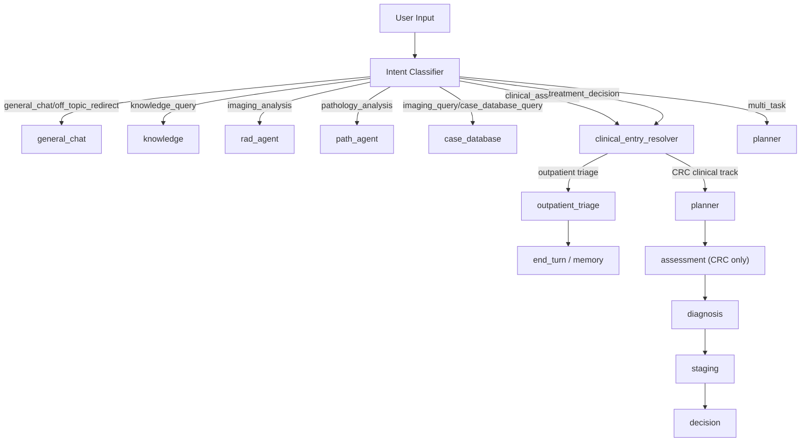

# Outpatient Triage vs CRC Clinical Routing Design

**Date:** 2026-04-10  
**Status:** Approved for planning  
**Goal:** Separate symptom-based outpatient GI triage from CRC case-completion questioning while preserving the current intent-classification and non-clinical routing behavior.

## 1. Context

The current platform already has a strong intent-routing backbone:

- `general_chat / off_topic_redirect` -> general chat
- `knowledge_query` -> knowledge retrieval
- `imaging_analysis` -> radiology agent
- `pathology_analysis` -> pathology agent
- `imaging_query / case_database_query` -> case database
- `clinical_assessment / treatment_decision` -> clinical flow

The problem is inside the clinical flow. Symptom-only inputs such as "我腹痛" are currently absorbed into the same CRC-oriented assessment track that asks for pathology confirmation, imaging evidence, and TNM staging. That creates a semantic mismatch:

- outpatient GI triage should ask about symptoms, alarm features, and first-line workup
- CRC clinical assessment should ask about colonoscopy, pathology, imaging, TNM, and molecular markers

These are different workflows and should not share the same first question set.

## 2. Design Principles

- Preserve existing intent classification semantics as much as possible.
- Do not break current direct routes for chat, knowledge, imaging, pathology, or database queries.
- Add one new clinical entry resolution layer instead of rewriting the whole graph.
- Keep outpatient triage and CRC clinical assessment as separate tracks with separate state outputs.
- Allow the system to bypass outpatient triage when strong CRC abnormal-test signals already exist.
- When bypassing outpatient triage due to system-known CRC evidence, explain why before starting CRC follow-up.

## 3. Scope

### In scope

- Introduce a distinct `outpatient_triage` track for symptom-led GI triage
- Narrow the existing `assessment` node to CRC clinical case-completion
- Add a new `clinical_entry_resolver` that chooses between outpatient triage and CRC clinical assessment
- Add structured triage outputs for risk level, disposition, and suggested tests
- Preserve compatibility with current `user_intent`, `planner`, and non-clinical routes

### Out of scope

- Replacing the existing intent classifier with a totally new taxonomy
- General multi-specialty outpatient triage beyond GI symptom scenarios
- Reworking the treatment-decision loop, critic loop, or citation loop
- Building a full emergency-department protocol engine

## 4. Current-State Findings

### 4.1 Intent classification is mostly usable

The current intent layer already distinguishes:

- `general_chat`
- `knowledge_query`
- `imaging_analysis`
- `pathology_analysis`
- `imaging_query`
- `case_database_query`
- `clinical_assessment`
- `treatment_decision`
- `multi_task`

This is sufficient as a first-pass intent layer. The core issue is that `clinical_assessment` is overloaded.

### 4.2 CRC assessment currently mixes two different jobs

The current assessment flow asks for CRC case-completion items such as:

- pathology confirmation
- tumor location
- TNM staging
- MMR/MSI and related molecular items

This is correct for oncologic case workup but incorrect for symptom-led outpatient triage.

### 4.3 Existing `chat_main` is not a substitute for outpatient triage

`chat_main` currently supports field-by-field data collection, but its fields are CRC case fields rather than symptom triage fields. It should not be treated as the new GI triage track.

## 5. Proposed Architecture

### 5.1 Two-track clinical model

The system should keep one intent layer and add a second, narrower track-resolution layer:

1. Intent layer  
   Answer: what is the user asking for?

2. Clinical-entry layer  
   Answer: if this is a clinical request, should the system enter:
   - outpatient GI triage, or
   - CRC clinical assessment?

### 5.2 New routing flow



### 5.3 Compatibility rule

Non-clinical direct routes remain unchanged. Only clinical entry changes.

That means:

- `general_chat`, `knowledge_query`, `imaging_analysis`, `pathology_analysis`, `imaging_query`, and `case_database_query` continue to route exactly as they do now
- `multi_task` continues to use the planner
- `clinical_assessment` and `treatment_decision` gain one additional gate before entering the CRC flow

## 6. Track Resolution Rules

## 6.1 Inputs that enter `clinical_entry_resolver`

Only these intents should enter the resolver:

- `clinical_assessment`
- `treatment_decision`

### 6.2 Strong CRC abnormal-test signals

The resolver should treat the following as strong CRC signals:

- pathology confirms adenocarcinoma, carcinoma, malignant tumor, or equivalent malignant diagnosis
- colonoscopy reports mass, occupying lesion, suspicious malignant lesion, circumferential narrowing with tumor concern
- CT/MRI reports colorectal mass, tumor, malignant wall thickening, suspicious neoplasm
- existing TNM staging or explicit stage information already present
- the system already knows the patient is a CRC case from stored profile or database context

### 6.3 Weak signals that do not directly enter CRC clinical track

The following are not enough by themselves:

- positive fecal occult blood
- elevated CEA alone
- vague statements such as "医生怀疑有问题"
- benign polyp or inflammation without malignant suspicion

These should remain in outpatient triage unless stronger evidence is provided.

### 6.4 Resolver outcomes

- `treatment_decision` always enters the CRC clinical track
- `clinical_assessment` + strong current-turn CRC signal -> CRC clinical track
- `clinical_assessment` + strong system-known CRC signal -> CRC clinical track
- `clinical_assessment` + symptom-led presentation without strong CRC signal -> outpatient triage

## 7. Node Responsibilities

### 7.1 `intent_classifier`

Responsibilities:

- classify user intent
- preserve current categories
- do not decide between outpatient triage and CRC clinical assessment

Primary state writes:

- `findings.user_intent`
- `findings.requires_context`
- current multi-task metadata

### 7.2 `clinical_entry_resolver` (new)

Responsibilities:

- inspect current-turn text, current state, patient profile, and known database signals
- produce the clinical track decision
- never generate a long user-facing response

Primary state writes:

- `findings.encounter_track`
- `findings.clinical_entry_reason`
- `findings.known_crc_signals`

Possible values:

- `encounter_track`: `outpatient_triage | crc_clinical | non_clinical`
- `clinical_entry_reason`: `system_known_crc_signal | user_provided_abnormal_test | treatment_decision_request | none`

### 7.3 `outpatient_triage` (new)

Responsibilities:

- triage symptom-led GI complaints
- ask symptom questions only
- output risk level, disposition, and suggested tests
- stop the turn after triage output or follow-up question

Must not ask for:

- TNM staging
- MMR/MSI
- pathology subtype
- CRC treatment planning inputs

Primary state writes:

- `findings.triage_risk_level`
- `findings.triage_disposition`
- `findings.triage_suggested_tests`
- `findings.triage_summary`
- `findings.symptom_snapshot`

### 7.4 `assessment` (existing, narrowed)

Responsibilities:

- CRC case-completion questioning only
- pathology, colonoscopy, imaging, TNM, MMR/MSI, and related oncologic completeness checks

Must not serve as the outpatient triage node.

Primary state writes remain:

- `missing_critical_data`
- `active_inquiry`
- `inquiry_message`
- CRC-related findings

## 8. State Design

Add these fields to `findings` and snapshot outputs:

- `encounter_track`
- `clinical_entry_reason`
- `known_crc_signals`
- `triage_risk_level`
- `triage_disposition`
- `triage_suggested_tests`
- `triage_summary`
- `symptom_snapshot`
- `entry_explanation_shown`

Recommended payload shapes:

```json
{
  "encounter_track": "outpatient_triage",
  "clinical_entry_reason": "none",
  "known_crc_signals": {
    "pathology_confirmed": false,
    "colonoscopy_suspicious": false,
    "imaging_suspicious": false,
    "tnm_present": false,
    "crc_case_in_db": false,
    "evidence_summary": ""
  },
  "triage_risk_level": "medium",
  "triage_disposition": "urgent_gi_clinic",
  "triage_suggested_tests": ["血常规", "粪便常规+隐血", "肠镜"],
  "triage_summary": "便血伴排便习惯改变，建议尽快消化门诊评估。",
  "symptom_snapshot": {
    "chief_symptoms": ["便血", "腹痛"],
    "duration": "2周",
    "bleeding": true,
    "weight_loss": false,
    "bowel_change": true,
    "alarm_signs": []
  },
  "entry_explanation_shown": false
}
```

## 9. Rule Tables

### 9.1 What counts as symptom-led outpatient input

Examples:

- abdominal pain
- abdominal distension
- diarrhea
- constipation
- change in bowel habit
- hematochezia
- black stool
- tenesmus
- weight loss
- fatigue
- appetite loss

### 9.2 Outpatient triage risk levels

`high`

- heavy or ongoing bleeding
- severe abdominal pain
- obstruction-like presentation
- systemic deterioration
- high-risk combination such as weight loss plus bleeding

`medium`

- intermittent bleeding
- persistent abdominal pain
- persistent diarrhea or constipation
- ongoing bowel-habit change
- anemia-like symptoms or weight loss without instability

`low`

- mild short-duration symptoms
- no alarm signs
- no bleeding, no weight loss, no persistent bowel change

### 9.3 Outpatient dispositions

- `emergency`
- `urgent_gi_clinic`
- `routine_gi_clinic`
- `observe`
- `enter_crc_flow`

### 9.4 Suggested test patterns

Symptom-led recommendations should map to common GI outpatient workup:

- abdominal pain -> CBC, CRP, stool routine/occult blood, abdominal imaging when indicated
- hematochezia or bowel-habit change -> CBC, stool occult blood, rectal exam/anorectal exam, colonoscopy
- chronic diarrhea -> stool routine, stool culture as needed, CBC, CRP, colonoscopy if persistent or alarm features
- weight loss/anemia suspicion -> CBC, stool occult blood, colonoscopy, abdominal CT when indicated

## 10. Direct CRC Entry Explanation

When a user gives only symptoms but the system already knows strong CRC abnormal-test evidence, the system should bypass outpatient triage and explain why.

This explanation should not be a separate control-flow node. Instead, the first CRC follow-up message in `assessment` should prepend a one-time explanation when:

- `clinical_entry_reason == "system_known_crc_signal"`
- `entry_explanation_shown == false`

Recommended message structure:

1. Explain that the system already sees strong abnormal-test evidence
2. State that the conversation is therefore moving into CRC clinical assessment
3. Continue immediately with the first CRC case-completion question

This avoids creating a noisy extra assistant bubble.

## 11. Frontend Presentation

### 11.1 Conversation text

Outpatient triage messages should sound like outpatient triage:

- symptom clarification
- risk summary
- disposition
- suggested tests

CRC clinical messages should sound like case-completion:

- pathology confirmation
- colonoscopy findings
- imaging conclusion
- TNM completion

### 11.2 Card strategy

Add one new card type:

- `triage_card`

Recommended fields:

- `risk_level`
- `disposition`
- `chief_symptoms`
- `alarm_signs`
- `suggested_tests`
- `when_to_seek_urgent_care`

Do not add a separate CRC entry explanation card.

### 11.3 Card priority

Recommended inline-card priority:

1. `decision_card`
2. `triage_card`
3. `patient_card`
4. `imaging_card`
5. `tumor_detection_card`
6. `radiomics_report_card`

This keeps triage visible without overpowering downstream decision cards.

### 11.4 Roadmap presentation

Outpatient triage roadmap:

- symptom intake
- risk stratification
- disposition
- suggested tests

CRC roadmap:

- abnormal-evidence confirmation
- pathology/colonoscopy completion
- imaging/TNM completion
- staging and decision

## 12. File-Level Change Plan

### Backend

- `src/prompts/intent_prompts.py`
  - clarify that `clinical_assessment` is a general clinical entry intent, not automatically CRC-case completion
- `src/nodes/intent_nodes.py`
  - preserve current categories
  - keep writing `user_intent`
- `src/nodes/router.py`
  - add `clinical_entry_resolver` route handling
  - keep non-clinical direct routes unchanged
- `src/graph_builder.py`
  - add `clinical_entry_resolver` node
  - add `outpatient_triage` node
  - route `clinical_assessment` and `treatment_decision` through the resolver
- `src/nodes/assessment_nodes.py`
  - narrow the node to CRC case-completion logic
  - support one-time direct-entry explanation
- `src/nodes/outpatient_triage_nodes.py`
  - new node for GI outpatient triage
- `src/state.py`
  - add track and triage fields

### Frontend

- `frontend/src/features/cards/card-renderers.tsx`
  - add `triage_card`
- `frontend/src/app/store/stream-reducer.ts`
  - register `triage_card` as an eligible inline card
- existing roadmap and conversation UI
  - reuse as-is with new data

## 13. Testing Strategy

### Backend routing tests

- symptom-only `clinical_assessment` without CRC signals -> `outpatient_triage`
- symptom-only input with system-known CRC signal -> `assessment`
- explicit abnormal colonoscopy/pathology/imaging text -> `assessment`
- `treatment_decision` always enters CRC track
- non-clinical intents keep current direct routing

### Backend node tests

- outpatient triage returns risk/disposition/tests
- outpatient triage does not set CRC missing fields such as TNM requirements
- CRC assessment does not ask generic outpatient symptom questions when direct CRC entry is active
- one-time entry explanation is emitted only once

### Frontend tests

- `triage_card` renders correctly
- `decision_card` remains higher priority than `triage_card`
- inline triage results attach to the latest assistant message
- roadmap displays outpatient vs CRC steps correctly

## 14. Acceptance Criteria

This design is successful when:

1. Symptom-only inputs no longer trigger immediate CRC case-completion questions.
2. Users with known abnormal CRC test evidence bypass outpatient triage and receive an explanation before CRC follow-up.
3. Non-clinical intent routing keeps current behavior.
4. CRC clinical follow-up remains compatible with the existing planner, diagnosis, staging, and decision flow.
5. Frontend can show structured triage results as a first-class card.

## 15. Implementation Notes

The safest rollout is incremental:

1. Add state fields and routing gate
2. Add `outpatient_triage` node
3. Narrow `assessment`
4. Add `triage_card`
5. Add regression coverage

This avoids destabilizing the existing CRC decision pipeline while separating the two questioning modes cleanly.
