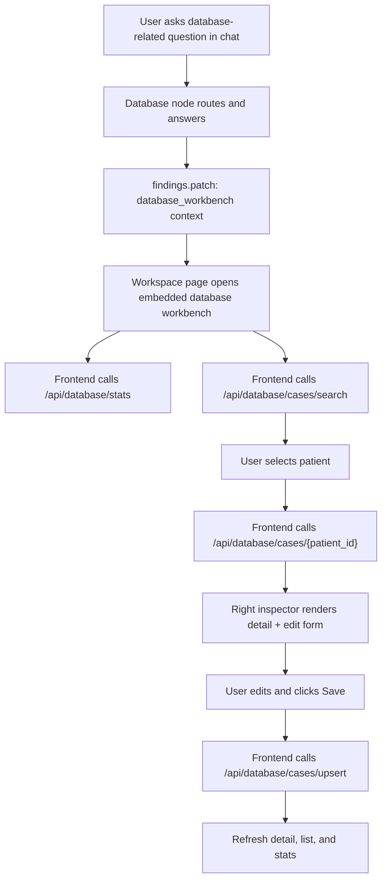

# Chat Workspace Database Workbench Design

**Date:** 2026-04-13  
**Status:** Approved for planning  
**Goal:** Bring database statistics, filtered case search, patient detail viewing, and confirmed record writeback into the chat workspace while keeping the current `/database` page as a dedicated full-page console.

## 1. Context

The product currently has two separate experiences:

- `/` chat workspace for conversational agent interaction
- `/database` database console for direct structured database work

The database console already supports:

- overall database statistics
- structured and natural-language-backed filtering
- case list pagination and sorting
- patient detail inspection
- manual patient record editing with writeback

The gap is the chat workspace. Database-related user questions currently route to the database node and can return a patient card or textual summary, but the workspace cannot yet expose the same query and editing affordances that exist on `/database`.

The target behavior is:

- database-related chat turns automatically reveal a database workbench inside the chat workspace
- the user can continue talking while using the workbench
- the user can inspect and edit a patient record through a form/card and explicitly confirm save
- non-database chat turns do not permanently clutter the workspace with database UI

## 2. Design Principles

- Reuse existing database API endpoints and frontend components where practical.
- Keep conversational routing responsible for intent and context, not for every interactive query action.
- Require explicit user confirmation for writeback through a visible save button.
- Avoid duplicating the same patient content in multiple panels when the workbench is active.
- Preserve the dedicated `/database` page; the chat workbench is an embedded surface, not a replacement.

## 3. Scope

### In scope

- Add an embedded database workbench to the chat workspace
- Auto-expand the workbench when database-related chat intent is detected
- Support overall database stats, case search, case detail inspection, and manual writeback from the chat workspace
- Reuse existing `/api/database/*` endpoints for interactive workbench actions
- Extend database-node output so the frontend knows when and how to open the workbench
- Add frontend and backend tests for the new workspace behavior

### Out of scope

- Replacing the `/database` page
- Natural-language direct writeback without a form
- New aggregation APIs beyond the existing fixed stats endpoint
- Bulk editing or multi-record writeback
- Making the database workbench globally persistent for all chat threads

## 4. Current-State Findings

### 4.1 The database page already contains most of the UI and data behavior

The current database page already handles:

- initial bootstrap via `getDatabaseStats()` + `searchDatabaseCases()`
- natural language query parsing to structured filters
- case detail loading
- writeback through `upsertDatabaseCase()`

This behavior should be extracted into shared stateful logic rather than reimplemented inside the workspace page.

### 4.2 The chat workspace already supports streamed card context

The workspace already consumes:

- snapshot cards
- streamed `card.upsert`
- streamed `findings.patch`
- inline cards attached to assistant messages

That means the backend does not need a new dedicated streaming protocol for the workbench. It only needs to emit enough structured context for the workspace page to know when the embedded database area should appear and what it should preload.

### 4.3 The right inspector is already the best place for detail + editing

The existing workspace layout has:

- left rail for uploads and roadmap
- center workspace for conversation
- right inspector for cards and structured support panels

The workbench should therefore split responsibilities:

- center workspace: database query bar, stats, list results
- right inspector: patient detail + editable form when a patient is selected

## 5. Recommended Architecture

## 5.1 High-level model

The chat workspace gains an embedded `DatabaseWorkbench` region below the conversation panel.



## 5.2 Why this architecture

- It keeps conversational state and interactive data operations separated cleanly.
- It lets the chat node decide visibility and initial context without forcing every filter change through the LLM.
- It minimizes backend changes because the REST API already exists.
- It keeps writeback deterministic and auditable through explicit button-based saves.

## 6. Frontend Design

## 6.1 New shared database workbench state

Introduce a shared frontend hook, for example `useDatabaseWorkbench`, to own:

- stats payload
- search request
- search response
- selected patient id
- case detail payload
- editable record draft
- natural query text
- parsing/search/detail/save loading flags
- page-level error message

This hook will be reused by:

- `DatabasePage`
- `WorkspacePage` embedded workbench

This removes duplication and ensures both surfaces behave identically.

## 6.2 New workspace database workbench panel

Add a new component under the center workspace, for example `WorkspaceDatabaseWorkbench`.

Responsibilities:

- render only when `database_workbench.visible` is true
- show a compact section header with:
  - title
  - close/hide button
  - mode badge such as `Stats`, `Search`, `Edit`
- render:
  - `DatabaseNaturalQueryBar`
  - stats cards
  - `DatabaseResultsTable`

The panel is not shown by default and is mounted only when activated by chat context or manually re-opened during the same thread session.

## 6.3 Right inspector behavior

When the embedded workbench is active:

- the right inspector should prioritize database-specific support panels:
  - `DatabaseDetailPanel`
  - `DatabaseEditForm`
- the generic `ClinicalCardsPanel` remains available, but duplicate patient card display should be avoided

Recommended rule:

- if workbench is visible and a database patient is selected, show:
  1. `DatabaseDetailPanel`
  2. `DatabaseEditForm`
  3. `ClinicalCardsPanel` with overlapping case cards filtered out
- otherwise preserve the existing inspector order

Filtered card types while a selected database patient is active:

- `patient_card`
- `imaging_card`
- `pathology_slide_card`

This avoids showing the same patient summary twice in different presentations.

## 6.4 Visibility model

The workbench should auto-open when a database-related chat turn produces database workbench context.

Once opened, it should remain visible for the current thread until:

- the user explicitly closes it, or
- the thread is reset

If another database-related turn occurs later, the workbench should reopen automatically and replace its context with the latest one.

This matches the user requirement of automatic appearance without forcing the panel to flicker in and out after every turn.

## 6.5 Initial load behavior

When opening the workbench:

- if mode is `stats` or `search`, load:
  - `getDatabaseStats()`
  - `searchDatabaseCases(initialRequest)`
- if mode includes a selected patient id, additionally load:
  - `getDatabaseCaseDetail(patientId)`

If the backend supplies structured filters, they should seed the search request before the first search call.

## 6.6 Save flow

The save flow remains button-confirmed:

1. user edits form fields
2. user clicks `保存记录`
3. frontend calls `upsertDatabaseCase`
4. on success:
   - update detail payload
   - refresh current search results
   - refresh stats
5. on failure:
   - keep the draft intact
   - show a visible error banner inside the workbench

No automatic save is allowed from chat text alone.

## 7. Backend Design

## 7.1 No new interactive REST surface

Keep using existing endpoints:

- `GET /api/database/stats`
- `POST /api/database/cases/search`
- `GET /api/database/cases/{patient_id}`
- `POST /api/database/cases/upsert`
- `POST /api/database/query-intent`

The workspace workbench should behave as another API client for these endpoints.

## 7.2 New database workbench context in findings

Extend database-node outputs so database-related turns patch a new structure into findings:

```json
{
  "database_workbench": {
    "visible": true,
    "mode": "search",
    "query_text": "查一下 093 号患者",
    "filters": {
      "patient_id": 93
    },
    "selected_patient_id": 93
  }
}
```

Suggested schema:

- `visible: bool`
- `mode: "stats" | "search" | "detail" | "edit"`
- `query_text: str | null`
- `filters: object | null`
- `selected_patient_id: int | null`

This should be delivered through the existing `findings.patch` stream event path.

## 7.3 Database node trigger rules

The database node should write workbench context for these cases:

- overall database stats questions
  - mode: `stats`
  - selected patient id: `null`
- multi-patient or filtered search questions
  - mode: `search`
  - filters populated when known
- single-patient info questions
  - mode: `detail`
  - selected patient id set
- explicit edit/update requests
  - mode: `edit`
  - selected patient id required when available

Important rule:

- edit intent opens the edit workflow but does not auto-call `upsert_patient_info`

The actual writeback remains a frontend-triggered REST call after human confirmation.

## 7.4 Context derivation

The node may derive the initial workbench context from:

- parsed patient id in the user request
- search tool arguments when the LLM called `search_cases`
- explicit `get_database_statistics` usage
- explicit `get_patient_case_info` usage

The workbench context must be consistent with what the assistant actually did in the turn. If the node answered from patient 93, the selected patient id should be 93.

## 8. Data Flow Details

## 8.1 Search-oriented flow

1. user asks a database query in chat
2. backend routes to database node
3. backend emits assistant response and `findings.database_workbench`
4. workspace opens workbench with initial filters
5. frontend calls stats + search APIs
6. user refines filters directly in the workbench
7. frontend calls search APIs without another chat turn

## 8.2 Detail/edit-oriented flow

1. workbench has a selected patient
2. frontend loads patient detail
3. right inspector shows detail cards and edit form
4. user edits fields and clicks save
5. frontend posts to `upsert`
6. frontend refreshes detail, list, and stats

## 8.3 Close/reopen flow

1. user closes workbench
2. local workspace state marks workbench hidden
3. existing chat thread state remains intact
4. next database-related turn sets `visible=true` again and reopens it

## 9. Error Handling

Frontend:

- failed stats/search/detail/save requests show workbench-local error banners
- failed save preserves the current form draft
- failed detail fetch clears only detail-specific state, not the whole workbench

Backend:

- if no valid patient id can be inferred for an edit request, emit `mode=search` instead of `mode=edit`
- if the database node can answer only partially, still emit the best available workbench context

User-facing behavior:

- the workbench should remain stable when an API call fails
- no silent dismissal of the panel on error

## 10. Testing Plan

## 10.1 Frontend tests

Add workspace tests covering:

- database-related turn opens embedded workbench
- non-database turn does not open workbench
- single-patient database turn preselects the patient and loads detail
- edit-mode database turn exposes the save form
- save calls `upsertDatabaseCase` and refreshes detail, list, and stats
- closing the workbench hides it locally
- resetting the thread clears the workbench state

Add hook/component tests covering:

- shared workbench hook bootstrap behavior
- search request state transitions
- save success and failure behavior

## 10.2 Backend tests

Add database-node tests covering:

- stats query patches `findings.database_workbench` with `mode=stats`
- filtered search query patches `mode=search` and carries filters
- single-patient query patches `selected_patient_id`
- edit request opens `mode=edit` without auto-upsert

## 10.3 Regression focus

Verify that:

- existing `/database` page still works unchanged from the user perspective
- existing inline patient card behavior in chat still works when workbench is not active
- non-database routes remain unaffected

## 11. Implementation Notes

- Favor extracting shared database-page state first, then embedding it in the workspace.
- Keep the backend addition limited to `findings.database_workbench` unless a concrete blocker appears.
- Avoid introducing a brand new event type unless `findings.patch` proves insufficient.
- Keep the save contract identical to the dedicated database page to minimize risk.

## 12. Open Questions Resolved

- Database workbench placement: embedded below the conversation panel in the chat workspace
- Appearance rule: auto-expand only for database-related chat turns
- Writeback mode: editable form/card with explicit human-confirmed save
- Persistence rule: remain visible for the thread until closed or reset
