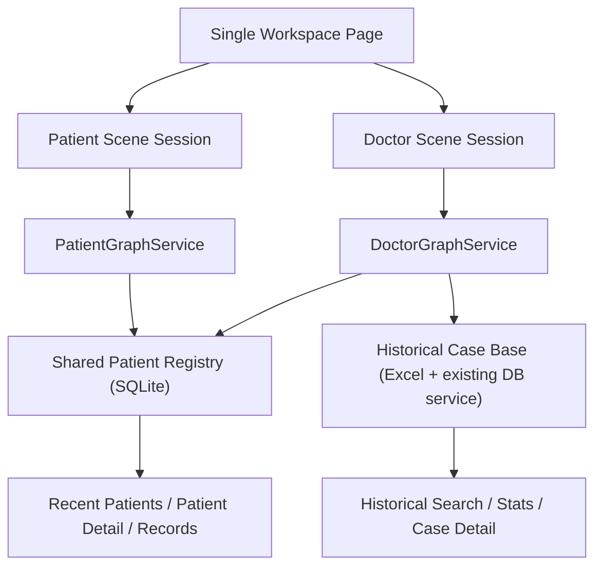
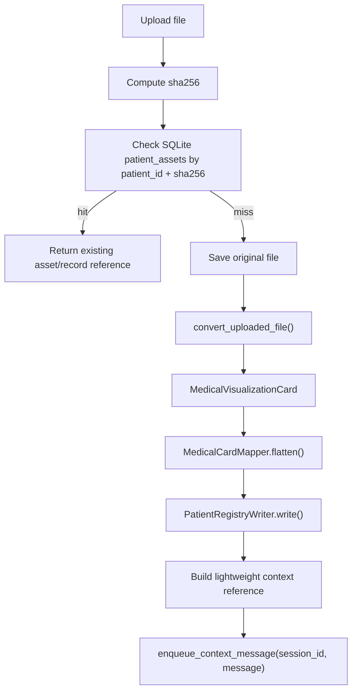

# Scene-Driven Dual-Session Workspace Design

**Date:** 2026-04-16  
**Status:** Approved for planning  
**Goal:** Restructure the current generic workspace into a scene-driven product with a single-page scene switcher, separate patient and doctor sessions, automatic patient-side intake into a shared registry, and doctor-side query/access to the same patient data without sharing chat history.

## 1. Context

The current product already has most of the raw building blocks:

- FastAPI BFF with session, chat, database, upload, and asset routes
- a React workspace with conversation, uploads, cards, roadmap, execution plan, and database workbench panels
- a LangGraph-based backend graph with intent, triage, assessment, database, radiology, pathology, decision, and citation nodes
- a document conversion pipeline that can parse uploads into structured medical-card-style output

The problem is not missing capability. The problem is product shape.

The current workspace is a generic console. The target product is scene-driven:

- a patient scene for guided inquiry, uploads, symptom analysis, and pre-visit intake
- a doctor scene for patient lookup, detail review, historical case querying, imaging/pathology analysis, and decision support

The user wants both scenes to live inside one page, switchable in place, while keeping:

- one patient-scene session
- one doctor-scene session
- no shared chat history between scenes
- one shared patient data layer that both scenes can access

## 2. Design Principles

- Split by scene, not by raw technical capability.
- Keep patient and doctor chat sessions independent.
- Make the shared patient registry the only cross-scene bridge.
- Use SQLite as the source of truth for draft/current patient registry writes.
- Keep historical case data read-only and separate from draft/current patient data.
- Reuse existing frontend panels and backend services where the boundaries already fit.
- Prefer lightweight context references over injecting large structured JSON blobs into graph state.
- Keep Phase 1 physically simple: minimize file moves and global refactors.

## 3. Confirmed Decisions

The following choices are already resolved and form the baseline:

- Architecture target: scene-driven workspace plus shared patient registry
- Single page with in-page scene switching
- Separate patient and doctor sessions
- Shared structure only: patient data, uploaded assets, extracted records, and summaries
- Patient-side data automatically persists into the shared patient registry
- Doctor-side patient access is manual selection plus recent-patient shortcuts
- Doctor and patient sessions never share conversation history
- `GraphService` becomes two independent services:
  - `PatientGraphService`
  - `DoctorGraphService`
- In Phase 1, both graph builders remain in [src/graph_builder.py](/D:/YiZhu_Agnet/LangG/src/graph_builder.py:1)
- Binding state uses existing `context_state` keys rather than a new `SessionMeta` field
- Lazy doctor-side patient-context injection happens in `DoctorGraphService.stream_turn()`, not in `payload_builder`
- `payload_builder` remains a pure function
- `PatientGraphService` runs with `context_finalizer=None`
- Scene switching aborts the active stream in Phase 1
- `context_maintenance` polling only follows the active scene in Phase 1

## 4. Scope

### In scope

- Single-page scene shell with patient/doctor switching
- Dual sessions with separate session ids and snapshots
- Shared patient registry backed by `runtime/patient_registry.db`
- Patient-side draft patient creation at session creation time
- Upload rewrite flow from session-JSON injection to registry-first persistence
- Doctor-side recent-patient panel and manual patient binding
- Dual graph builders and dual graph services
- Frontend hook split for scene sessions and patient registry access

### Out of scope

- Background stream keepalive across scene switches
- Doctor session switching between multiple patients without reset
- Patient registry stats in Phase 1
- Physical split into separate `patient_graph.py` and `doctor_graph.py` modules
- Replacing the historical case base
- Writing draft/current patient data back into Excel

## 5. Target Architecture

### 5.1 Layers

1. `Scene Shell`
- One page
- Current scene selection
- Scene-specific view composition

2. `Scene Session Layer`
- Independent patient session
- Independent doctor session
- Scene-specific graph service selection

3. `Shared Patient Registry`
- SQLite-backed draft/current patient entity store
- Shared across both scenes
- Source of truth for uploads, extracted records, and patient snapshots

4. `Historical Case Base`
- Existing `classification.xlsx` and virtual database services
- Read-only historical case retrieval and statistics
- Separate from draft/current registry writes

5. `Scene Graph Layer`
- patient graph
- doctor graph
- shared nodes reused by both graphs where appropriate

### 5.2 High-level flow



## 6. Shared Storage Design

### 6.1 Storage split

- Shared patient registry: `runtime/patient_registry.db` (SQLite)
- Historical case base: `classification.xlsx` plus existing read services

Phase 1 rules:

- draft patient records write only to SQLite
- no draft/current writes go to Excel
- Excel remains a parallel read-only historical source

### 6.2 Draft patient creation

When `POST /api/sessions` is called with `scene=patient`:

1. create a new patient session id and thread id
2. immediately create one draft patient row in SQLite
3. let SQLite `AUTOINCREMENT` generate the stable `patient_id`
4. store that `patient_id` in `SessionMeta.patient_id`
5. return the session with the bound `patient_id`

This guarantees that uploads occurring during the inquiry process always have a valid patient target.

### 6.3 Proposed SQLite tables

Phase 1 minimum:

- `patients`
  - `id`
  - `status` (`draft | active`)
  - `created_by_session_id`
  - flattened current patient snapshot fields
  - `created_at`
  - `updated_at`
- `patient_assets`
  - `asset_id`
  - `patient_id`
  - `filename`
  - `content_type`
  - `sha256`
  - `storage_path`
  - `source`
  - created timestamp
- `patient_records`
  - `record_id`
  - `patient_id`
  - `asset_id`
  - `record_type`
  - `normalized_payload_json`
  - `summary_text`
  - `source`
  - created timestamp

Possible Phase 2 addition:

- `patient_events`

### 6.4 Snapshot merge rule

The patient snapshot in `patients` must use a non-empty merge policy.

If a later upload provides only a subset of fields, it must not erase previously known values with placeholder-style entries such as:

- `not_provided`
- `Unknown`
- `pending_evaluation`
- `null`
- empty string

The merge rule belongs in the registry writer, not in the graph and not in an LLM prompt.

### 6.5 Treatment draft safety rule

`treatment_draft` from `MedicalVisualizationCard` must not be written into the flattened `patients` snapshot.

It may be retained only inside `patient_records.normalized_payload_json`, because it is model-derived extraction content rather than doctor-confirmed plan state.

## 7. Upload Rewrite Flow

### 7.1 Current issue

The existing upload flow injects full derived medical-card JSON into session context for the next graph turn. This creates two problems:

- large structured payloads bloat graph/checkpointer state over time
- patient-generated data is not registry-first and is harder to consume from the doctor scene

### 7.2 Existing normalization capability

[src/services/document_converter.py](/D:/YiZhu_Agnet/LangG/src/services/document_converter.py:1) already produces normalized, Pydantic-validated `MedicalVisualizationCard` output. Phase 1 does not need a new LLM intake agent.

The upload chain should be:

1. raw upload received
2. `convert_uploaded_file()` returns `MedicalVisualizationCard`
3. `MedicalCardMapper` flattens fields into registry-friendly structures
4. `PatientRegistryWriter` writes SQLite rows
5. lightweight session reference message is enqueued

### 7.3 Phase 1 upload pipeline



### 7.4 Service responsibilities

- `MedicalCardMapper`
  - pure mapping function
  - no LLM
  - maps `MedicalVisualizationCard.data` into:
    - flattened patient snapshot fields
    - record payload
    - record summary text
- `PatientRegistryWriter`
  - SQLite write service
  - handles:
    - patient snapshot merge
    - asset insert/dedup
    - record insert
  - may also build the final lightweight reference message

### 7.5 Deduplication semantics

Persistent deduplication source:

- SQLite `patient_assets`
- dedupe by `patient_id + sha256`

`SessionMeta.processed_files` should no longer be the source of truth for persistence. It may remain only as a session-local in-flight guard.

### 7.6 Session-side upload state

Keep `uploaded_assets` in session state in Phase 1, but downgrade its semantics. It becomes a recent-upload view rather than the authoritative data source.

Suggested shape:

```json
{
  "asset_id": "asset_xxx",
  "record_id": 123,
  "patient_id": 456,
  "filename": "report.pdf",
  "reused": false
}
```

Do not store `derived.medical_card_created` as the main cross-scene reference. `record_id` is the durable pointer.

### 7.7 Lightweight context message rule

After a successful registry write, enqueue only a lightweight reference message, such as:

- filename
- saved record id
- current patient id
- concise extracted summary
- optional key staging snippet

Do not inject the full medical-card JSON into the graph state.

## 8. Doctor Read Model

### 8.1 Two read sources

Doctor scene accesses two distinct data domains:

1. `Patient Registry`
- draft/current patient data from SQLite
- recent patients
- patient detail
- records and uploaded assets

2. `Historical Case Base`
- historical structured cases from the current Excel-backed data layer
- stats
- filtered case search
- natural-language-backed case search

These sources must not be physically merged in Phase 1.

### 8.2 BFF read services

- `PatientRegistryReadService`
  - `list_recent_patients()`
  - `search_patients(filters)`
  - `get_patient_detail(patient_id)`
  - `list_patient_records(patient_id)`
- `HistoricalCaseReadService`
  - existing `database_service.py` behavior retained
- `DoctorWorkbenchQueryService`
  - thin facade
  - routes calls by `scope`

### 8.3 Frontend model

Doctor scene uses both:

- always-on patient registry access
- graph-driven database workbench for historical case search

The patient registry panel is not driven by `findings`. It is frontend-initiated.

Phase 1 rule:

- no patient registry stats endpoint
- historical stats remain in the historical case workbench only

## 9. Graph and Session Design

### 9.1 Graph builders

Phase 1 keeps both build functions in [src/graph_builder.py](/D:/YiZhu_Agnet/LangG/src/graph_builder.py:1):

- `build_patient_graph(settings: Settings) -> Runnable`
- `build_doctor_graph(settings: Settings) -> Runnable`

This avoids a large physical refactor while still separating assembly logic.

### 9.2 Graph factory

The current single compiled-graph singleton expands into two independent singletons:

- `_patient_graph`
- `_doctor_graph`

Expose:

- `get_patient_graph()`
- `get_doctor_graph()`

### 9.3 Graph services

Two fully independent services:

- `PatientGraphService`
- `DoctorGraphService`

They do not share:

- compiled graph instance
- context finalizer
- graph-specific injection behavior

A thin `SceneGraphRouter` may exist only as a service locator for routes. It does not own business logic.

### 9.4 App runtime

`AppRuntime` should expose:

- `session_store`
- `scene_router`
- `patient_registry_service`
- runtime and asset roots

This replaces the old assumption of a single graph service instance.

### 9.5 SessionMeta

Phase 1 additions to `SessionMeta`:

- `scene: "patient" | "doctor"`
- `patient_id: int | None`

Do not add a dedicated `binding_state` field. Use existing `context_state` keys for binding tracking, for example:

- `bound_patient_id`
- `bound_patient_snapshot_version`

### 9.6 Session APIs

Required session endpoints:

- `POST /api/sessions`
  - request body includes `scene`
  - patient scene creates draft patient and returns `patient_id`
- `GET /api/sessions/{id}`
- `PATCH /api/sessions/{id}`
  - bind doctor session to a patient id
- `POST /api/sessions/{id}/reset`

Phase 1 `PATCH` semantics:

- doctor scene only
- bind, not generic update
- allowed transition: `null -> patient_id`
- if already bound to a different patient, return `409`
- must reset before rebinding to another patient

### 9.7 Lazy patient-context injection

Lazy doctor-side patient-context injection happens at the start of `DoctorGraphService.stream_turn()`.

Why:

- `payload_builder` stays pure
- SQLite reads stay inside the service layer
- injection timing is tied to actual graph execution, not session mutation side effects

Pseudo flow:

1. doctor session receives a new turn
2. service checks `meta.patient_id`
3. compare against `context_state.bound_patient_id` and snapshot version
4. if unbound or stale:
  - load patient summary from registry
  - enqueue one lightweight context message
5. then call `build_graph_payload(...)`

### 9.8 Context maintenance

Phase 1:

- `PatientGraphService` uses `context_finalizer=None`
- patient scene does not run background context maintenance
- doctor scene may keep context maintenance if needed

## 10. Frontend Architecture

### 10.1 Scene shell

Keep one page at [frontend/src/pages/workspace-page.tsx](/D:/YiZhu_Agnet/LangG/frontend/src/pages/workspace-page.tsx:1), but convert it into a scene shell.

Recommended composition:

- `WorkspaceSceneShell`
- `SceneSwitcher`
- `PatientWorkspaceView`
- `DoctorWorkspaceView`

### 10.2 Scene session bootstrap

Introduce `useSceneSessions()`:

- bootstrap patient session
- bootstrap doctor session
- persist both ids separately
- recover or recreate both together
- own current `activeScene`

Local storage keys:

- `langg.workspace.patient-session-id`
- `langg.workspace.doctor-session-id`

Phase 1 recovery rule:

- if either stored session returns `404`, clear both keys and recreate both sessions

### 10.3 Scene switching and streaming

Phase 1 rule:

- switching scenes aborts the active stream

This keeps stream ownership simple and avoids simultaneous cross-scene streaming updates.

### 10.4 Frontend state split

Three state groups:

1. `Scene session state`
- patient session id and snapshot
- doctor session id and snapshot

2. `Doctor registry state`
- recent patients
- patient search results
- selected patient candidate
- patient detail

3. `Graph-driven workbench state`
- historical case workbench
- still managed by `useDatabaseWorkbench`

### 10.5 Patient registry frontend access

Add a new hook:

- `usePatientRegistry()`

Responsibilities:

- load recent patients on doctor-scene entry
- search patient registry
- load patient detail and records
- trigger doctor-session patient binding

This hook is always-on in the doctor scene and does not depend on `findings`.

### 10.6 Database workbench scope

Extend `useDatabaseWorkbench()` with `scope`.

Phase 1 scopes:

- `historical_case_base`
- `patient_registry` (optional limited support)

At minimum, `scope` must participate in bootstrap lifecycle so data source changes cause re-bootstrap.

### 10.7 View composition

`PatientWorkspaceView`

- conversation
- uploads
- cards
- optional patient summary panels

`DoctorWorkspaceView`

- conversation
- recent patients panel
- bound patient summary panel
- historical case workbench
- cards
- roadmap
- execution plan

### 10.8 Types and client changes

Frontend API types must be extended so `SessionResponse` mirrors backend session shape:

- `scene`
- `patient_id`

Client additions:

- `createSession(scene)`
- `bindPatient(sessionId, patientId)`
- patient-registry read APIs

## 11. Error Handling and Phase 1 Constraints

### 11.1 Upload persistence

Registry-first write semantics are all-or-nothing:

- SQLite write failure means upload fails
- session does not retain phantom extracted state

### 11.2 Doctor patient binding

- cannot switch bound patient without session reset
- this is intentional in Phase 1

### 11.3 Scene switching

- active stream is aborted on scene switch
- background stream continuity is out of scope

### 11.4 Context maintenance polling

Frontend context-maintenance polling follows the active scene only.

This is acceptable in Phase 1 because:

- patient scene has no context maintenance
- doctor scene polling stopping while hidden is an accepted temporary limitation

## 12. Testing Strategy

### 12.1 Backend

- patient session creation creates draft SQLite patient and returns stable `patient_id`
- doctor session creation returns `patient_id = null`
- upload writes:
  - asset row
  - record row
  - merged patient snapshot
- second upload for the same `patient_id` with only partial fields does not overwrite existing non-empty snapshot fields
- duplicate upload for same `patient_id + sha256` reuses existing asset/record
- doctor `PATCH /api/sessions/{id}` binds only once
- `DoctorGraphService.stream_turn()` injects patient context only when needed
- historical case APIs keep existing behavior

### 12.2 Frontend

- `useSceneSessions()` boots and restores both sessions
- `404` recovery clears both scene keys and recreates both sessions
- scene switch aborts active stream
- recent patients panel loads without graph findings
- selecting a patient calls bind API and refreshes doctor session state
- patient view uploads against patient session id only
- doctor view submits prompts against doctor session id only
- workbench re-bootstrap occurs when `scope` changes

### 12.3 Regression focus

- existing `/database` page remains usable during Phase 1
- existing historical database workbench behavior remains intact
- patient-side upload and card rendering still works after registry rewrite
- doctor-side graph behavior remains independent of patient-side chat history

## 13. Implementation Sequence

1. Add SQLite-backed patient registry service and draft-patient creation flow.
   SQLite service logic can be completed independently; the session-creation wiring is completed in step 2.
2. Extend `SessionMeta`, session APIs, and frontend session types.
3. Rewrite upload flow to registry-first persistence with lightweight context reference.
4. Split graph builders and instantiate `PatientGraphService` / `DoctorGraphService`.
5. Add doctor bind-patient flow and lazy context injection.
6. Introduce scene shell and `useSceneSessions()`.
7. Add `usePatientRegistry()` and recent-patient doctor panel.
8. Extend `useDatabaseWorkbench()` with `scope`.
9. Add backend and frontend regression coverage.

## 14. Acceptance Criteria

This design is successful when:

1. Patient scene and doctor scene use different sessions and never share chat history.
2. `scene=patient` session creation immediately returns a stable SQLite-backed `patient_id`.
3. Patient uploads are persisted into SQLite and become doctor-queryable without copying chat history.
4. Doctor scene can bind one patient at runtime and receive lightweight patient context on the next graph turn.
5. Historical case search remains available as a separate read model.
6. Scene switching happens inside one page and preserves separate scene state.
