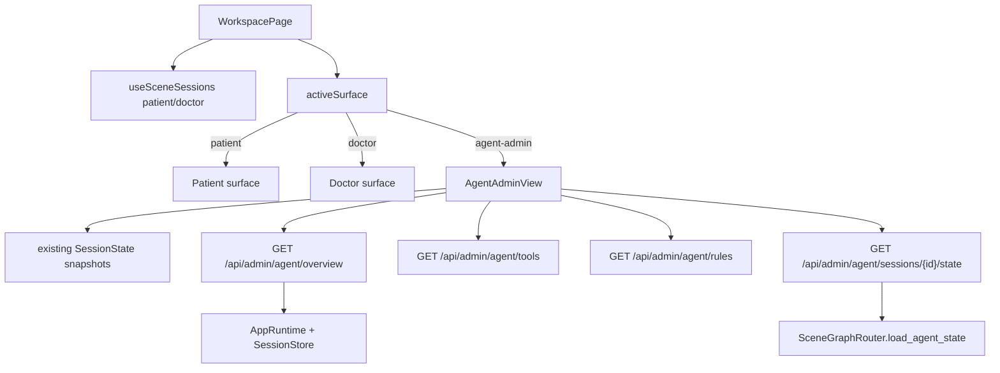

# Agent Admin Phase One Design

Date: 2026-06-14

## Goal

Build the first phase of an internal agent admin surface for LangG. Phase one must let an operator inspect what the large-model agent is doing and retaining without changing the clinical graph behavior.

This phase also changes the current patient/doctor scene switch into a collapsible menu that can select Patient, Doctor, or Agent Admin. The Agent Admin frontend uses the company logo and a restrained company-red theme.

## Current Context

The project already has the main runtime data needed for an observability-first admin page:

- `CRCAgentState` contains plan, execution graph, step history, memory summary, structured summary, RAG traces, subagent reports, node timings, critic/evaluator state, references, and patient context fields.
- `/api/sessions/{session_id}` already returns a recovery snapshot with messages, cards, roadmap, findings, patient profile, references, plan, critic, context state, and context maintenance status.
- SSE already emits `status.node`, `plan.update`, `references.append`, `critic.verdict`, `context.maintenance`, `trace.start`, `trace.step`, `trace.summary`, and `done`.
- The frontend already keeps patient and doctor session state in `WorkspacePage` through `useSceneSessions()`.
- `ClinicalTopNav` already renders the company logo through `CompanyBrandLogo`.
- Admin authorization already exists conceptually through `API_ADMIN_BEARER_TOKEN`, but only a few sensitive routes are currently gated.

The project does not yet have:

- a versioned permanent-rule model;
- a scheduler or job table for daily autonomous literature collection;
- a durable global agent knowledge store separate from session/context memory;
- a lightweight declarative tool manifest that can be read without constructing all tools.

Phase one should therefore avoid pretending those systems exist.

## Scope

Phase one includes:

1. A shared collapsible surface switcher for Patient, Doctor, and Agent Admin.
2. A new Agent Admin frontend surface inside the existing workspace shell.
3. A company-red admin theme and company logo usage.
4. Read-only admin APIs for agent overview, tool inventory, and rule catalog.
5. Agent Admin panels for memory, plans, tools, rules, learning readiness, trace/latency, and evidence.
6. Tests that lock the new navigation behavior, admin API contracts, and theme boundaries.

Phase one excludes:

- editing prompts, permanent rules, or policies;
- enabling/disabling runtime tools;
- daily scheduler execution;
- automatic paper ingestion into RAG;
- cross-session global memory writes;
- changing clinical graph topology or tool selection behavior.

## Design Options

### Option A: Add Agent Admin as a Third Workspace Surface

Keep `WorkspacePage` as the owner of patient and doctor sessions. Add a separate `activeSurface` value:

- `patient`
- `doctor`
- `agent-admin`

`activeSurface` controls what is rendered. Existing `activeScene` remains limited to graph scenes, `patient | doctor`, and is used only when submitting chat turns. Selecting Agent Admin does not create a graph scene.

Benefits:

- Agent Admin can inspect the already-loaded patient and doctor `SessionState` objects.
- It avoids a second session bootstrap path.
- It keeps the menu behavior simple.
- It avoids making `/agent` accidentally create new patient/doctor sessions.

Trade-off:

- Direct deep linking to the admin page is not included in phase one.

Recommendation: use Option A for phase one.

### Option B: Add a Separate `/agent` Route

Create `AgentAdminPage` as a separate route and let it call admin APIs independently.

Benefits:

- Direct URL is clean.
- Page ownership is isolated.

Trade-off:

- The page must rediscover or recreate session context.
- It duplicates some `useSceneSessions()` concerns.
- Switching between patient, doctor, and admin becomes route/state coordination rather than one local surface state.

This should wait until the admin page needs standalone operation.

### Option C: Add Admin as a Doctor Tab

Add `admin` to the doctor navigation tabs.

Benefits:

- Smallest UI change.

Trade-off:

- It hides Agent Admin under the doctor role, which is not accurate.
- It does not satisfy the requested Patient / Doctor / Admin top-level switcher.

Do not use this option.

## Navigation Design

Replace the current profile switch button behavior with a reusable collapsible menu.

Component shape:

- `WorkspaceSurfaceSwitcher`
  - props:
    - `activeSurface: "patient" | "doctor" | "agent-admin"`
    - `items`
    - `onSelect(surface)`
  - uses the same visual position currently occupied by `.clinical-profile-switch`.
  - opens a compact popover/list when clicked.
  - list items:
    - Patient
    - Doctor
    - Agent Admin

Behavior:

- Clicking the current profile/surface button toggles the list.
- Selecting Patient:
  - aborts the current active turn if needed;
  - sets `activeScene = "patient"`;
  - sets `activeSurface = "patient"`;
  - applies the `patient-care` theme.
- Selecting Doctor:
  - aborts the current active turn if needed;
  - sets `activeScene = "doctor"`;
  - sets `activeSurface = "doctor"`;
  - applies the `doctor-cockpit` theme.
- Selecting Agent Admin:
  - aborts the current active turn if needed;
  - leaves `activeScene` unchanged for future chat submission context;
  - sets `activeSurface = "agent-admin"`;
  - applies the `agent-admin` theme.

Accessibility:

- The trigger uses `aria-haspopup="menu"` and `aria-expanded`.
- The menu uses `role="menu"`.
- Each item uses `role="menuitem"`.
- `Escape` closes the menu.
- Clicking outside closes the menu.
- Current item is marked with `aria-current="page"` or a visible selected state.

The existing top navigation tabs inside the doctor surface remain doctor-specific. The surface switcher is separate from doctor tabs such as Consultation, Database, and Multimodal.

## Agent Admin Visual Design

Theme name: `agent-admin`

Add the theme to `useDocumentTheme`:

```ts
export type WorkspaceTheme = "doctor-cockpit" | "patient-care" | "agent-admin";
```

Add a new token block:

```css
:root[data-theme="agent-admin"] {
  color-scheme: light;
  --color-canvas: #fff7f7;
  --color-surface: #ffffff;
  --color-surface-muted: #f9eeee;
  --color-primary: #c9142f;
  --color-primary-hover: #a90f26;
  --color-primary-soft: rgba(201, 20, 47, 0.1);
  --color-danger: #b42335;
  --color-text: #211416;
  --color-text-muted: #70585d;
  --color-border: #ead4d8;
  --color-border-soft: rgba(120, 20, 35, 0.12);
  --clinical-command-surface: rgba(255, 255, 255, 0.92);
  --clinical-command-surface-strong: #ffffff;
}
```

The page should be company-red accented, not a fully red page. Use red for:

- active navigation;
- key metric accents;
- selected admin tab;
- status outlines;
- primary action styling.

Use neutral white, soft gray, and dark text for the main surfaces. This keeps the backend operational and readable.

Logo:

- Reuse `CompanyBrandLogo`.
- Use `brandLogoVariant="dark"` on the light red admin theme.
- The Agent Admin top nav brand should read `亿铸科技后台` or `智能体后台`, depending on final copy preference. Phase one uses `智能体后台` with the company logo as the stronger brand signal.

## Agent Admin Page Layout

Create `frontend/src/features/agent-admin/agent-admin-view.tsx`.

The page is a dense operational interface, not a marketing page.

Recommended layout:

- Top band:
  - selected watched session: Patient / Doctor / Both;
  - runtime mode;
  - session ids;
  - last snapshot version;
  - active run / idle state.
- Main grid:
  - left column: Agent Memory and Context Rules.
  - center column: Plan/DAG and Runtime Trace.
  - right column: Tool Inventory and Learning Readiness.
- Bottom section:
  - Evidence and References table.

Panel details:

### Agent Memory

Read from existing session state:

- `contextState.summary_memory`
- `contextState.structured_summary`
- `structured_summary.immutable_info`
- `structured_summary.dynamic_info`
- `structured_summary.anchor_events`
- `summary_memory_cursor`
- `contextMaintenance`

Copy should make the boundary explicit: this is session/context memory, not model-weight training.

### Plan and DAG

Read from:

- `state.plan` from recovery snapshot;
- future admin state endpoint for `execution_graph` and `step_history`.

Phase one can render a table first and a simple edge list/DAG visualization if the data is available. If `execution_graph` is absent, the panel falls back to the plan table.

### Runtime Trace

Read from:

- frontend trace store for the latest in-browser trace;
- `trace.*` events collected during the active page lifetime;
- `node_timings` once exposed by admin state API.

Display:

- graph path;
- node durations;
- tool calls;
- retrieval hits;
- response chars/tokens where available.

### Tool Inventory

Read from new read-only admin API:

`GET /api/admin/agent/tools`

Display:

- tool name;
- category;
- registry membership;
- reachable nodes;
- patient-safe / doctor-only / admin-only flags;
- dependency status where known;
- notes for known gaps.

Known first-phase inventory should include:

- graph-level tools from `list_tools()` / `list_tools_with_web_search()`;
- database node tools from `ATOMIC_DATABASE_TOOLS`;
- executor tools from `list_all_tools()`;
- planner abstract tool types from `PlanStep.get_valid_tool_types()`;
- `search_latest_research` marked as available in all web-search tools but not graph-level by default.

Do not construct heavyweight tools just to render this list. Use static metadata.

### Rule Catalog

Read from new read-only admin API:

`GET /api/admin/agent/rules`

Display read-only rule groups:

- routing policies from `src/policies/routing_policy.py`;
- review policies from `src/policies/review_policy.py`;
- planner prompt rules from `src/prompts/planner_prompts.py`;
- intent routing prompt rules from `src/prompts/intent_prompts.py`;
- knowledge synthesis rules from `src/prompts/knowledge_prompts.py`;
- memory retention rules from `src/nodes/memory_nodes.py`;
- context maintenance rules from `backend/api/services/context_maintenance.py`;
- safety/evaluator/citation prompts from `src/prompts/evaluation_prompts.py`.

Each rule item should show:

- id;
- title;
- owner module;
- rule type: prompt | policy | memory | safety | tool-routing;
- editable: false;
- short description;
- source file path.

Phase one should not expose full prompt editing. It may show excerpts if they are useful, but the source file link and description are enough for the first control plane.

### Learning Readiness

Phase one shows readiness, not execution.

Display:

- daily autonomous learning status: disabled / not configured;
- available research search tool: `search_latest_research`;
- whether `WEB_SEARCH_ENABLED` is true;
- whether `search_latest_research` is graph-level: false in current design;
- planned future job fields:
  - topic list;
  - schedule time;
  - source filters;
  - approval mode;
  - target store;
  - last run;
  - last learned artifacts.

The panel should clearly state that automatic paper collection and ingestion are phase two.

### Evidence and References

Read from:

- `references`;
- future admin state endpoint for `retrieved_evidence` and `rag_trace`.

Display:

- title/source;
- page/section;
- snippet;
- retrieval profile;
- tool name;
- timestamp where available.

## Admin API Design

Add `backend/api/routes/agent_admin.py`.

Mount prefix:

```py
router = APIRouter(prefix="/api/admin/agent", tags=["agent-admin"])
```

Security:

- update `_requires_admin_token()` so every `/api/admin` path requires the admin bearer token when `AUTH_MODE=bearer`.

Endpoints:

### `GET /api/admin/agent/overview`

Query:

- `patient_session_id?: str`
- `doctor_session_id?: str`

Returns:

- runtime mode;
- runner mode;
- web search enabled;
- checkpoint kind;
- session summaries for supplied sessions;
- active run ids;
- snapshot versions;
- context maintenance statuses.

### `GET /api/admin/agent/sessions/{session_id}/state`

Returns a sanitized agent-state inspection payload.

Include:

- `current_plan`
- `execution_graph`
- `step_history`
- `summary_memory`
- `structured_summary`
- `retrieved_references`
- `retrieved_evidence`
- `rag_trace`
- `subagent_reports`
- `node_timings`
- `stage_timings`
- `retrieval_timings`
- `critic_review_signal`
- `evaluator_review_signal`
- `evaluation_report`
- `citation_report`

Exclude:

- raw binary assets;
- API keys;
- full hidden chain-of-thought;
- large raw messages by default.

### `GET /api/admin/agent/tools`

Returns a static manifest. Do not instantiate all LangChain tools on request.

Suggested schema:

```json
{
  "items": [
    {
      "name": "search_treatment_recommendations",
      "category": "rag",
      "registries": ["graph", "executor"],
      "reachable_nodes": ["knowledge", "decision"],
      "patient_safe": true,
      "doctor_safe": true,
      "admin_safe": true,
      "dependencies": ["rag"],
      "status": "available",
      "notes": ""
    }
  ]
}
```

### `GET /api/admin/agent/rules`

Returns static read-only rule metadata.

Suggested schema:

```json
{
  "items": [
    {
      "id": "routing.intent.knowledge_query",
      "title": "Knowledge query routes to knowledge node",
      "type": "policy",
      "module": "src.policies.routing_policy",
      "source_path": "src/policies/routing_policy.py",
      "editable": false,
      "description": "Single-task knowledge_query turns route directly to knowledge retrieval."
    }
  ]
}
```

## Data Flow



Agent Admin should be able to render partial data. If admin APIs fail, it should still show the locally held patient/doctor state and a clear error in the affected panel.

## Error Handling

- If no session id exists, show an empty state for that session.
- If admin token is missing or invalid, show a 403/401 admin access message.
- If `load_agent_state()` returns empty state, show session metadata and mark detailed state unavailable.
- If tool manifest or rule catalog fails to load, show panel-level error without taking down the whole page.
- If context maintenance is running, show stale/refreshing state instead of claiming memory is complete.

## Testing

Backend tests:

- `/api/admin/*` requires admin bearer token.
- `GET /api/admin/agent/tools` returns known tool entries without constructing heavyweight tools.
- `GET /api/admin/agent/rules` returns non-empty rule groups.
- `GET /api/admin/agent/sessions/{id}/state` sanitizes binary/secret-like fields and includes memory/plan fields.

Frontend tests:

- surface switcher opens/closes and selects Patient, Doctor, Agent Admin.
- selecting Agent Admin does not create a new graph scene.
- Agent Admin applies `agent-admin` theme.
- company logo is visible on Agent Admin.
- Tool Inventory renders static manifest entries.
- Rule Catalog renders read-only rules.
- Learning Readiness shows daily learning disabled/not configured in phase one.

Visual/e2e checks:

- desktop and mobile Agent Admin views have no overlapping text.
- surface menu remains usable on mobile.
- red theme is visibly distinct from doctor dark and patient green themes.
- logo is visible and not distorted.

## Acceptance Criteria

Phase one is complete when:

1. The top-right surface switcher is a collapsible menu with Patient, Doctor, and Agent Admin.
2. Patient and Doctor still work exactly as before after selection from the menu.
3. Agent Admin can be selected without starting a new graph run.
4. Agent Admin shows the company logo and uses the company-red theme.
5. Agent Admin displays at least:
   - patient/doctor session metadata;
   - memory summary / structured summary when present;
   - current plan;
   - references;
   - tool inventory;
   - rule catalog;
   - learning readiness status.
6. Admin APIs are protected by the admin bearer token.
7. Tests cover the new switcher, admin API contracts, and theme boundary.

## Future Phases

Phase two:

- add persistent `agent_learning_jobs` storage;
- add schedule configuration;
- add manual "run now" for literature collection;
- store learned artifacts separately from session memory;
- require review before adding learned artifacts to RAG.

Phase three:

- versioned editable rules;
- rule diff and rollback;
- tool enable/disable policy;
- cross-session global agent knowledge;
- monitoring dashboard for learning job quality, source freshness, and failed ingestions.

## Implementation Notes

Keep phase one boring and observable. The admin surface should make the current agent understandable before it makes the agent configurable.

The highest-risk implementation choices are:

- accidentally treating Agent Admin as a third graph scene;
- exposing hidden reasoning or large raw message payloads;
- instantiating heavyweight tools in a read-only manifest endpoint;
- making the red theme override patient/doctor themes globally.

The design avoids these by keeping `activeSurface` separate from `activeScene`, using sanitized admin state payloads, static manifest metadata, and a dedicated `agent-admin` theme block.
